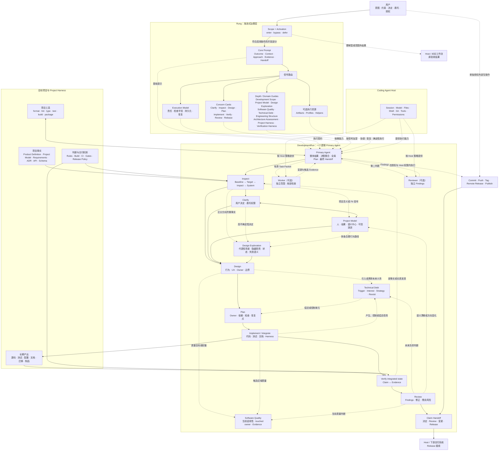

# Rung 产品需求与系统设计

> 版本：v0.1.2-draft
> 状态：Development
> 稳定基线：v0.1.0（2026-08-20）
> 文档职责：Rung 的产品形态、系统边界、治理模型与实现原则的唯一事实源

## 1. 执行摘要

Rung 是运行在 Coding Agent Host 之上的软件开发渐进式治理 Skill。它覆盖指导具体修改的决定、软件变更和可验证交付；自动调用由实质工程决定触发，明确而局部的修改使用 Host 普通编码路径。

Rung 的默认形态是一层很薄的提示：

```text
Outcome · Context · Approach · Evidence · Handoff
```

Coding Agent 保持原有的推理、工具选择和实现风格。Rung 负责观察当前任务需要哪些开发关注面，并只提供能够改善下一步判断的内容。

当用户表达、项目事实或后续能力无法直接形成一致的产品含义时，Rung 可以引导 Clarify 与 Inspect 建立一个可修正的 Project Model。它压缩项目当前服务的人、核心情境、可观察结果、语义中心、决策优先级、归属边界和可信演进，并供后续 Design、结构判断与 Review 使用。

当下一项重要设计仍有多条会造成不同工程后果的合理路径时，Rung 可以加载 Design Exploration。它使用少量能够区分方向的代表性场景发现隐藏职责、状态、失败语义和权衡，再把已接受方向交给 Design；方向清楚的任务不会承担这份上下文。

当当前修改需要实质质量判断时，Rung 聚焦 touched ownership boundary 的当前适用性；当项目状态在可信变化、维护事件或时间节点下形成可避免未来负担时，Rung 单独判断 Technical Debt。两个 Guide 按信号加载，分别产生当前质量行动和未来义务管理决定。

每次 DevelopmentRun 由一个逻辑 Primary Agent 对集成结果负责。默认执行形态是一个 Primary Agent 和一个主 Session；检查半径、持久状态、Worker 与独立 Reviewer 根据影响、协调、恢复和风险信号增加。

Rung 的产品承诺是：

> 以尽可能低的上下文和流程成本，帮助 Coding Agent 把当前软件开发 Claim 推进到有证据支持、与请求相称的交接状态。

一次 DevelopmentRun 从 Code Project Development Intent 开始，在当前 Claim 达到 `decision complete`、`review complete`、`change verified`、`release ready`、`published` 或具有明确恢复条件的 `blocked handoff` 时结束。Release 只在当前请求包含发布就绪性、版本、制品、发布动作或下游交付时进入。范围外工作由 Coding Agent Host 或对应下游系统接续。

## 2. 背景与机会

### 2.1 Coding Agent 已具备开发执行能力

现代 Coding Agent 通常能够阅读代码、编辑文件、执行测试、使用 Git、构建项目和调用外部工具。模型会根据用户目标与仓库事实选择具体实现方式。

开发质量仍会受到几个时点的影响：

- 用户意图存在关键歧义；
- 仓库约束、用户已有修改或事实源尚未进入上下文；
- 项目骨架、概念归属、模块边界或依赖方向需要结合当前代码判断；
- 接口、数据、依赖或发布影响容易被低估；
- 完成声明缺少实际测试、构建或制品证据；
- 代码已经修改，文档、版本或交付信息尚未同步。

这些时点适合加入短小、相关、可立即行动的提醒。

### 2.2 固定流程会产生治理成本

所有任务都显式经历需求文档、设计、计划、Gate、Review 和 Release Artifact，会带来以下成本：

- 小修改的准备时间超过实施时间；
- 大量模板挤占项目代码与用户需求的上下文；
- Agent 为满足流程字段生成低价值内容；
- 固定顺序限制模型根据仓库与问题选择路径；
- 边缘场景不断累积为更多规则和分支；
- 流程本身成为维护对象。

Rung 使用渐进式治理控制这些成本。治理深度由当前信号决定，资源只在能够改变决策时进入上下文。

### 2.3 完整覆盖与轻量执行可以同时成立

Rung 保留 Clarify、Inspect、Design、Plan、Implement、Verify、Review 和 Release 八个软件开发关注面。它们共同定义产品覆盖范围，并作为可组合的提示卡存在。

一次局部 Bugfix 可以自然完成理解、定位、修复、验证和交付，无需显式维护八阶段状态。一次数据迁移可以加载设计、计划、验证和发布提示，并使用持久 Artifact 支持跨会话执行。

## 3. 产品定义

### 3.1 产品形态

Rung 的第一产品形态是单一 Skill，由六类资源组成：

1. **Core Prompt**：极小的默认治理提示与按需路由；
2. **Execution Model**：DevelopmentRun 的责任、检查半径、持久化、协作和恢复契约；
3. **Concern Cards**：Clarify 到 Release 的独立提醒；
4. **Domain Guides**：只在特定复杂信号出现时加载的详细工程指南；
5. **Optional Assets**：复杂任务需要的开发制品模板；
6. **Deterministic Helpers**：重复、可机器检查工作使用的脚本。

自然语言判断由 Coding Agent 完成。确定性工具在能够提高可靠性、可复现性或效率时使用。

### 3.2 核心能力

Rung 提供十四项核心能力：

1. **开发意图路由**：按 4.1 分别判断开发范围和启用条件，在实质工程决定或明确治理请求下进入；
2. **完整开发覆盖**：Intent 到 Release 的关注面均有可用提示；
3. **执行责任模型**：每次 DevelopmentRun 由一个逻辑 Primary Agent 持有集成结果，并按需扩展会话、Worker 与独立 Review；
4. **信号驱动治理**：风险或不确定性出现时增加治理深度；
5. **渐进披露**：只加载当前判断需要的 Reference；
6. **项目画像**：在项目含义、语义中心、能力归属或演进方向存在实质不确定性时，把用户意图与项目现实合成为可修正的 Project Model；
7. **设计探索**：在重要设计存在多条后果明显不同的合理路径时，通过代表性场景发现行为、职责、状态、失败语义和方向权衡；
8. **工程结构治理**：在 Design、Implement 和 Review 出现结构信号时，按需判断概念归属、修改局部性、信息隐藏、依赖知识、状态语义和抽象依据；
9. **架构评估**：在已有系统审查需要形成改造、兼容或 Release 决策时，围绕当前驱动、变化场景和仓库证据识别主要结构矛盾；
10. **软件质量与技术债治理**：分别判断软件当前适用性与可信演进中的未来工程负担，在触及范围内改善质量，并对有效债务作出携带、控制、偿还、替换或退役决定；
11. **Project Harness 治理**：读取、诊断和渐进演进已有项目的事实源、测试、工程规则、构建、CI 与交付控制；
12. **验证系统治理**：在证据缺口或 Harness 增长信号出现时，引导 Agent 分层构建和维护验证入口；
13. **证据提醒**：完成、兼容和可发布结论关联实际观察；
14. **发布交接**：根据项目形态整理 revision、制品、文档和已知风险。

### 3.3 目标用户与项目

Rung 面向使用 Coding Agent 创建或修改软件的个人开发者和团队，适用于：

- 空项目、原型和首个版本；
- 已有代码但工程约束较少的项目；
- 具备测试、架构、文档和发布流程的成熟项目；
- 单体仓库、Monorepo 和多模块项目；
- 不同语言、框架、构建与包管理系统。

Rung 的核心提示与语言、框架解耦。仓库事实和项目工具决定实际命令、实现模式与交付形式。

### 3.4 成功标准

Rung 的实际价值通过行为判断：

- 普通任务的默认上下文开销很小；
- Rung 只在开发范围成立且满足启用条件后进入 DevelopmentRun；
- 主要验收结果止于理解代码库当前事实时，Skill 选择应保持安静；宿主偶发加载时，Scope Gate 在任何 Reference 或 Artifact 前退出；
- 仓库存在、文件位置、文件类型、工具使用和偶然产生的代码不会单独建立治理范围；
- 范围外工作在 Rung 偶发误触时于加载 Reference 前结束路由；混合任务中的各项结果保持清楚的 Owner、证据和授权；
- Agent 不因 Rung 自动创建低价值文档或工作区；
- 关键风险出现时，相关提醒能够及时进入决策；
- 稀疏或冲突的项目表达能够形成通俗、可修正且明确未知项的 Project Model；
- Project Model 区分用户确认、仓库证据、Agent 推断、来源冲突和未知信息，不从单一文档或偶然代码补全产品意图；
- 新能力能够依据当前用户、结果、语义中心和可信演进判断 Core fit、Adjacent extension 或 Identity change，并在用户主动改变方向时更新画像；
- Project Model 能够真实改善 Owner、UX、边界、命名、依赖、验证和后续变化局部性；普通任务不承担画像文档成本；
- Design Exploration 只在重要决定仍有多条工程后果不同的合理路径时加载，并通过最少代表性场景降低过早收敛、隐藏职责和无依据抽象；
- 方向清楚的局部变化不会生成候选方案仪式、Discovery 文档或额外 `.rung/` 状态；
- 工程设计提醒只在代码结构判断可能改变实现方向时加载；
- 新模块、公共表面、依赖和抽象能够由当前需求与仓库事实解释；
- Review 能够从实际 diff 发现修改扩散、知识泄漏和无依据复杂度；
- 显式架构评估围绕当前驱动和可信变化场景深入关键代码路径，并将重要 Finding 连接到仓库证据、结构机制、实际成本或风险；
- 架构评估主动检查反证，控制由文件大小、目录形态、模式名称或一般性代码异味产生的无依据 Finding；
- 架构修改建议说明最小连贯干预和独立验证方式，后续合理变化能够检验修改局部性、知识传播与兼容性是否真实改善；
- 普通实现与 Review 会让触及的 Owner 在正确性、可理解性、可修改性、可验证性、可运行性、一致性和可预测性方面保持与当前项目相称的质量；
- 质量判断围绕当前用户、维护者、环境、项目画像和实际证据展开，工具分数、文件大小与风格偏好只提供调查信号；
- 代码异味、TODO、年龄、复杂度或依赖版本只有在连接到当前承载状态、可信触发和未来负担机制后，才形成可管理的技术债；
- Agent 能够区分当前质量与未来负担，保留 Defect、Vulnerability、Risk、Feature Gap 和 Necessary Complexity 的主要分类与严重度；
- 显式债务审查能够识别相互传播、放大利息或阻塞清理的少数主导机制，并避免用 TODO 数量或统一分数代表项目混乱程度；
- 技术债优先进入项目已有 Issue、Roadmap、Architecture、Dependency、Migration 或 Harness Owner，只有未来消费者存在且缺少合适承载位置时才创建 Rung Artifact；
- 已有 Project Harness 可靠时被直接复用，出现冲突、误报、漏报、波动、漂移或 Gate 变化时能够进入独立诊断与渐进演进；
- 验证系统能够从支持当前声明的最低成本层开始，并明确入口、归属、环境、隔离、清理、诊断和维护条件；
- Agent 保留多样的实现和验证路径；
- 每次 DevelopmentRun 始终有一个对整体结果负责的 Primary Agent；
- 项目检查从安全所需的最小半径开始，只有影响信号出现时才扩展；
- Plan、持久化、额外 Session、Worker 和独立 Reviewer 都由实际协调或风险收益触发；
- Worker 产出经过 Primary Agent 集成，最终验证针对合并后的代码状态；
- 完成报告使用与当前 Claim 相称的交接状态，设计和审查结论无需虚构 Release Readiness；
- 完成、兼容和交付证据标识实际受检状态，检查期间发生的代码或 Plan 漂移会使 Evidence 失去适用性；
- 高风险或跨会话任务能够按需增加结构化治理；
- Ready 或 Published 的本地 Evidence 在格式、内部结果、代码状态和 Release-required Check 覆盖上保持一致；
- Release 交付对应明确代码状态和已知风险，外部 Evidence 的本地核验状态清楚可见。

## 4. 系统边界

### 4.1 开始边界：User Intent

Rung 从用户表达中识别主要验收对象。先用两个条件确认开发范围，再决定是否启用治理：

1. **Codebase relationship**：结果由一个软件代码库负责，或者是一项在正确性与维护周期上持续耦合于代码库的内容；
2. **Active development claim**：结果会形成持久项目修改、决定或指导一项具体修改，或者为当前变更与 Release 建立证据。

代码库耦合内容的正确性由代码行为、契约或 Release 状态决定，并由代码项目负责为其消费者持续同步。责任和维护周期建立这种关系；物理位置不能建立这种关系。尚未创建仓库的 Greenfield 代码项目同样可以满足进入条件。

Design、Review、Diagnosis 或 Assessment 的验收结果需要成为指导、接受、拒绝、排序或降低当前代码修改风险的决定与证据 Claim。结果停留在代码库当前事实理解时，代码库关系仍然存在，活跃开发 Claim 没有成立。可能发生的未来开发也不会自动扩大当前任务。

Project Model 和 Design Exploration 可以在代码修改前进入 DevelopmentRun，因为它们服务一项已经活跃的具体开发决定。任一开始条件缺失时，Scope Gate 在加载其他 Rung 内容前退出。

开发范围成立不等于自动启用 Rung。隐式调用还要求存在实质工程决定：职责和边界、契约、状态与失败、兼容迁移、验证机制或交付就绪性需要判断。行为、Owner、影响和检查均明确的局部可逆修改使用 Host 普通编码路径。项目大小、文件数量、公共调用者或常规测试要求本身不构成实质性。

显式要求使用 Rung，或要求架构评估、设计权衡、发布就绪审查等开发治理，可以用于范围内的小任务；显式调用只豁免实质性判断，不能补齐缺失的代码库关系或活跃开发 Claim。提到 Rung、引用调用示例、发现已安装文件不等于显式调用。

实质性未知时先在 Host 中做最小检查，不预加载治理、不单为分类询问用户；发现实质影响后重新判断。Activation 为 `enter`、`bypass` 或 `defer`，分别表示启用、继续普通路径和先检查再判断。Scope 与 Activation 分别记录，当前任务的启用状态不自动沿用到同仓库的后续任务。

### 4.2 开发范围与责任

Rung 在读取 Concern Card 前根据当前验收结果、开发 Claim 和长期 Owner 判断请求：

- **活跃开发**满足两项范围条件；存在实质工程决定或明确治理请求时进入 DevelopmentRun；
- **理解型结果**以代码库当前事实为验收终点，不加载 Rung Reference 或 Artifact；
- **范围外结果**没有代码库关系，不加载 Rung Reference 或 Artifact；
- **混合任务**只让满足范围与启用条件的部分进入 DevelopmentRun，其余结果保留各自的 Owner、证据方法、授权和恢复路径。

代码库关系本身不能建立 DevelopmentRun。仓库、Worktree、Manifest、受版本控制的文件、路径、文件类型、命令、工具、技术术语、工作量和偶然产生的代码同样不能单独建立范围。对事实来源、计划、审查、正确性或证据的一般需要也不能替代当前开发 Claim。

新证据改变主要验收对象时，Primary Agent 重新判断范围。理解型或范围外工作发现具体代码库问题后，可以在修改、设计决定或交付 Claim 进入用户请求时开始 DevelopmentRun；开发任务收敛为事实理解或其他结果时结束 Rung 路由。范围门控制 Rung 的上下文与责任，不阻断用户请求，也不改变 Host 的权限与安全策略。

### 4.3 结束边界：Claim Handoff

DevelopmentRun 的结束状态由当前验收 Claim 决定：

- **decision complete**：设计或诊断已经形成有证据、可执行且明确未知项的决定；
- **review complete**：审查或评估已经形成有边界、有证据、经过反证检查且可供用户判断的结论；
- **change verified**：授权范围内的修改已经集成，相关 Claim 在明确代码状态上获得相称验证；
- **release ready**：目标代码状态或制品满足当前项目声明的发布条件；
- **published**：当前 Claim 指定且经过授权的目标交付动作已经实际成功；提交、推送或 Tag 若只是前置动作，不能代替目标完成。部分失败保留已完成动作、阻塞影响与恢复条件；
- **blocked handoff**：权限、环境、事实、依赖或用户决定阻止当前 Claim 完成，并且阻塞证据、影响、下一 Owner 和恢复条件已经明确。

一次运行只采用当前 Claim 需要的结束状态。设计、诊断、Review 和 Architecture Assessment 可以在结论交接后完成；实施和 Release 权限需要由用户请求、委托与 Host 权限单独建立。新请求把既有决定转为代码修改时，可以继续原运行的持久状态，也可以创建新的 DevelopmentRun。

可安装入口 `rung/SKILL.md` 保留这些状态的最小判定条件，普通任务无需为了结束判断加载完整 Execution Model。Release Manifest 的 `ready`、`blocked` 分别对应 `release ready`、`blocked handoff`；Manifest 与整体 Claim 使用各自的状态字段。

### 4.4 Release 边界

当前 Claim 包含发布就绪性、版本、制品、发布动作或下游交付时，Release 的具体形态由项目决定，可以包括：

- 对应明确 revision 的代码、测试、配置和文档；
- 可复现生成的软件包、二进制、镜像或静态产物；
- 版本、Changelog 或 Release Notes；
- 验证结果、已知限制和未覆盖风险；
- 项目已有流程要求的 Manifest、签名或校验信息。

代码库没有独立打包产物时，Release Package 可以由可发布 revision、验证证据与交付说明组成。

### 4.5 Release 交接

Rung 可以开发和验证 Dockerfile、CI 配置、Helm Chart、Terraform、迁移文件、构建脚本和发布配置。当前授权目标本身是 Git Push、Tag、远端 Release 或包发布时，目标实际成功才记录为 `published`；包发布失败时，已经完成的推送只记录为部分进度。

部署执行、服务管理、流量切换、线上数据变更和运行状态由相应 Host 或交付系统执行。Rung 将经过验证的配置、制品引用、顺序、风险和恢复信息交给这些系统。

### 4.6 外部动作

用户授权和 Coding Agent Host 的权限模型控制提交、推送、发布、消息、部署及其他外部写操作。Rung 只在当前任务范围内提醒授权触发点和结果记录。

## 5. 渐进式治理模型

### 5.1 默认薄层

Rung 被选中后先按 4.1 核对开发范围与启用条件。简单局部修改继续 Host 路径；显式的小任务可以启用 Lite。未知情况先做最小项目检查；仅当范围决定仍需要额外解释时读取 Development Scope。混合任务分别判断各部分，启用治理后才进入以下基础提示。

启用后把以下判断留在会话内，直接落实为行为、不变量、Owner、相关失败与证据，无默认表单或四步流水线：

| 提示 | 关注问题 |
|---|---|
| Outcome | 用户最终需要观察到什么结果？ |
| Context | 哪些仓库事实、约束和已有修改影响这次工作？ |
| Approach | 当前最小且连贯的实现方向是什么？ |
| Evidence | 哪些实际结果足以支持完成声明？ |
| Handoff | 结果、证据、缺口和当前 Claim 状态是否足以交给下一 Owner？ |

Agent 可以在内部使用这些提示。用户侧只呈现有助于协作、决策或验证的信息。

### 5.2 治理循环

```text
User Intent
   ↓
Development Scope Gate
   ├─ 理解型结果或范围外结果 → Host / 对应工作流
   └─ 开发范围成立且满足启用条件的部分
                 ↓
            正常开发
                 │
                 ├─ 当前出现治理信号 → 加载一个相关提示卡
                 └─ 继续开发 → 收集相称证据 → 与 Claim 相称的交接
```

每次只处理当前最有价值的治理信号。未来可能经历的阶段不构成预加载理由；多个关注面只有在当前判断确实相互作用时同时进入上下文。新证据可以触发另一个提示卡，也可以回到先前关注面或重新判断开发范围。

### 5.3 治理信号

以下信号常常值得增加一层提醒：

- 用户目标、公共行为或验收方式存在关键歧义；
- 稀疏意图支持多个会改变产品、UX 或架构的合理解释；
- 项目文档、可观察行为、测试、代码语言或近期变化描绘出冲突的项目身份；
- 新能力接近当前语义边界，用户准备扩展产品方向，或者一个仓库包含多个可能独立的产品中心；
- 下一项重要设计仍存在多条会改变 Owner、契约、状态、UX、风险或实现方向的合理路径，当前事实不足以可靠收敛；
- 相关代码、仓库规则、命令或用户修改尚未定位；
- 变化涉及公共接口、持久化数据、认证、安全或隐私；
- 创建项目骨架、顶层模块或新的公共能力；
- 局部需求跨越现有边界，或者新增依赖、共享状态和抽象；
- 条件、状态或实际 diff 的增长显示概念归属可能需要重新判断；
- 当前修改使触及区域的正确性、可理解性、可修改性、可验证性、可运行性或项目一致性出现实质问题，或者这些质量目标之间的权衡会改变 Design 与交付判断；
- 当前代码、架构、数据、依赖、Harness、构建、Release 或事实源存在具体承载状态，并可能在可信变化、维护事件或时间节点下产生额外成本、风险、协调负担、传播或选择丧失；
- 用户要求系统审查技术债，或者多个临时路径、例外、重复事实和迁移缺口已经相互依赖并持续消耗演进能力；
- 用户要求审查已有架构、模块化、结构债务、依赖形态或框架适配，并需要据此形成改造、兼容或 Release 决策；
- 多模块、依赖方向、迁移顺序或回退条件需要协调；
- 任务跨会话、多人或多个执行单元；
- 测试、构建、兼容或发布结论需要证据；
- 现有检查无法证明当前声明，或者开始新增 Fixture、Mock、测试服务、文档检查、CI Gate、构建、打包或端到端基础设施；
- 验证入口出现重复、波动、环境泄漏、运行成本增长或失败诊断困难；
- 项目指令、需求、文档、测试、实现、静态规则、构建、CI 或 Release Policy 相互冲突，或者这些机制本身进入修改范围；
- 正确行为被拒绝、错误行为被接受，或者已有检查、规则、矩阵与 Gate 需要删除、放宽、替换或迁移；
- 实际 diff 超出最初预期；
- 发布信息、版本、制品或下游交接需要整理。

没有相关信号时，Agent 按普通开发方式继续。

### 5.4 可组合关注面

八个关注面提供开发导航：

```text
Clarify · Inspect · Design · Plan · Implement · Verify · Review · Release
```

它们支持以下组合方式：

- 小任务合并多个关注面；
- 已有明确需求时直接从 Inspect 或 Implement 开始；
- 项目已有设计和计划时沿用现有事实源；
- Verify 或 Review 发现新信息时回访相关关注面；
- Release-only 任务聚焦现有 revision、证据和制品；
- 高风险任务同时加载少量相关提示卡。

Stage 名称用于路由和交流，无需维护显式状态机。

Concern Card 是 Primary Agent 使用的能力入口，不与 Agent 数量或 Session 数量绑定。

Software Quality、Technical Debt、Project Model、Design Exploration、Engineering Structure、Architecture Assessment 和 Harness 等 Domain Guide 横跨一个或多个关注面。当前信号从所在 Concern Card 进入相应 Guide；Guide 不增加固定阶段。

### 5.5 模型自主性

Rung 的 Reference 主要包含五类内容：

1. 何时加载；
2. 值得考虑的问题；
3. 能够改变判断的失败模式与证据；
4. 复杂领域需要的方案、迁移、恢复和复查细节；
5. 值得进一步加深治理的信号。

Agent 根据项目事实决定顺序、工具、实现方式、测试策略和表达形式。项目已有规则与工具优先进入判断。

### 5.6 项目画像（Project Model）

Project Model 是项目或子系统当前身份、语义中心、决策边界和可信演进的紧凑、可核对表示。它在用户表达与项目事实无法直接支持一致设计时加载，并为当前或未来的实际决策服务。

Clarify 提供人的含义：使用者、情境、期望结果、例子、体验、接受方向和委托权限。Inspect 提供项目现实：可观察行为、公共接口、需求与文档、代码概念、数据、不变量、测试、Release、当前消费者和相关历史。Primary Agent 声明画像边界，并把两类输入合成为当前最有证据的模型。

“正确画像”表示它在当前证据下足够一致、能够被用户修正、可以预测真实后续决策，并明确暴露会改变判断的未知信息。证据支持多个产品解释时，Agent 保留少量候选画像，并用通俗结果帮助用户选择。画像中的重要陈述使用以下状态：

- **Accepted**：用户或经授权的项目事实已经确认；
- **Evidenced**：当前可观察行为或仓库契约直接支持；
- **Inferred**：由现有证据形成的最佳解释；
- **Contested**：可信来源之间存在冲突；
- **Unknown**：缺失信息可能改变模型或下一决定。

项目画像可以按需包含：一句话的人、核心情境、可观察结果与中心能力；产品形态和主要入口；少量核心概念、关系、不变量和共同语言；UX、正确性、兼容、数据、安全、性能、交付成本或修改局部性等决策优先级；最能代表项目的能力；相邻扩展与会改变产品身份的边界样例；可信演进、稳定承诺和 Revisit signal。

具体样例用于建立语义边界。Agent 可以把新能力判断为：

- **Core fit**：通过现有语义中心服务当前使用者与结果；
- **Adjacent extension**：服务相关情境，同时引入需要明确 Owner 的重要概念、工作流或边界；
- **Identity change**：改变主要使用者、核心结果、产品形态、共同语言或语义中心。

判断会检查新能力由哪个概念拥有、强化哪个不变量、是否引入第二个产品中心、能否隔离在稳定边缘、改变哪些质量或兼容责任，以及用户是否已经授权所需的产品方向变化。Fit 提供当前决策证据。用户主动扩展产品时，Primary Agent 更新画像、保留适用兼容、暴露迁移后果，并让 Design 建立新的连贯边界。

Project Model 给 Design 提供产品与 UX 方向，给 Engineering Structure 提供概念 Owner、边界与抽象依据，给 Architecture Assessment 提供 Driver、变化场景和干预价值，给 Review 提供语义漂移检查。数据库、并发、安全、部署、性能、组织 Owner 和 Harness 等实际约束继续通过 Inspect 与对应 Domain Guide 进入判断。

一个仓库、组织或部署单元可以包含多个语义中心。Project Model 先声明产品、子系统、Library 或 Workflow 边界；共享工具、身份契约和基础设施可以形成上层共同事实，独立使用者、工作流、语言、数据或发布方向保留各自模型。

局部、可逆画像留在 Session 或 Design reasoning。跨 Session、多个执行者、正式 Review 或临时比较可以使用 `.rung/runs/<run-id>/project-model.md`。经过接受且会指导未来工作的长期画像进入项目已有 README、Product Definition、Requirement、Domain Glossary、Architecture Overview 或其他 Owner；项目缺少承载位置时可以按需使用 `assets/project-model.template.md`。同一事实只保留一个维护位置。

持久化的 Project Model 属于 Project Harness 的意图与事实源。画像与需求、行为、测试、代码或 Release 出现实质权威冲突时，继续路由 Project Harness。普通局部任务、含义清楚的 Feature 和已经有可靠事实源的项目不创建额外画像文件。

Project Model 可以确定项目身份、语义中心、质量优先级和 Feature fit，但这些信息不一定能够直接决定具体行为路径。下一项重要设计仍存在多条工程后果明显不同的合理解释时，继续加载 Design Exploration；其输出再由 Design 形成接受的行为、契约和结构方向。

### 5.7 设计探索（Design Exploration）

Design Exploration 是 Clarify、Project Model 与 Design 之间按信号加载的 Domain Guide。它服务一个已经进入 DevelopmentRun 的具体设计决定，触发条件同时包含三项事实：当前存在活跃开发决定；至少两条路径在现有证据下仍然可信；路径差异会改变行为、Owner、公共契约、状态、数据、UX、依赖、风险、验证或实施方向。

Design Exploration 先声明需要支持的单一决定、阻止可靠选择的不确定性、已接受约束、委托权限和下一位结果消费者。Inspect 只补充能够区分候选方向的项目事实；Project Model 在产品身份、语义中心、Feature fit 或主动演进影响决定时提供方向。代码库当前事实理解本身不会触发这份 Guide，因为 Development Scope Gate 已经在它之前运行。

Primary Agent 选择能够区分方向的最小代表性场景。场景可以覆盖主要成功路径，以及会真实改变设计的使用者、输入、失败、拒绝、中断、恢复、状态转换、并发、兼容、迁移、上线或回退条件。场景数量没有固定要求；新增场景需要能够揭示不同的职责、状态、契约、失败含义、质量权衡或选择。

每个场景沿可观察行为展开：触发者与前置条件、执行前后状态、持久数据与副作用、外部依赖与权限、失败可见性、Retry Owner、取消、补偿、恢复、负责决定与不变量的概念，以及能够独立验证行为的证据。策略选择、Fallback、协调、翻译、信任与恢复经常在这里暴露隐藏职责。模块、接口和抽象在职责可见后再进入结构判断。

重要陈述继续区分 Accepted、Evidenced、Inferred、Contested 与 Unknown。只有会改变当前方向的 Unknown 才触发进一步检查或用户问题；缺少权威来源的合理细节保留为假设。Design Exploration 不追求完整需求枚举，也不把开放世界扩展成无界场景树。

候选方向只保留会产生实质不同后果的路径。命名、类布局或局部实现变体不单独构成候选，方案数量没有预设目标；代表性场景与证据真实收敛到一个方向时，一个方案同样有效。Primary Agent 使用相同场景比较候选方向的用户流程、恢复体验、概念归属、公共契约、状态与数据语义、依赖知识、修改局部性、质量属性、验证可行性、兼容、迁移、回退、可逆性、交付成本和可信演进。

需要用户决定时，Clarify 用通俗语言给出推荐、当前可见后果、可信开发影响、可逆性和最小必要选择。用户委托范围内的专业选择由 Primary Agent 作为项目设计师完成，并对所有人相关表面进行 UX 判断。接受方向连同代表性场景、发现的职责与状态、失败语义、证据需要、重要替代方向、权衡、Owned Unknown 和 Revisit signal 交给 Design；Engineering Structure 再把这些语义映射到代码 Owner 与边界。

当代表性场景足以区分重要方向、关键职责与失败语义达到当前决定所需清晰度、会改变方向的 Unknown 已有 Owner 或 Revisit signal，并且 Design 能够在不依赖关键脑补的情况下继续时停止探索。继续工作只增加低价值细节时立即退出这份 Guide。

探索结果默认留在 Session。跨 Session、多个执行者、正式 Review 或重复决策形成未来消费者时，结果进入项目已有 Product、Design、Issue 或 Architecture 事实源；项目暂时没有承载位置时可以按需使用 `assets/solution-design.template.md`。Rung 不默认创建 Discovery 文档或 `.rung/` Artifact。

### 5.8 工程结构与架构评估

Rung 使用两层按需治理处理代码与架构的连续关系：

- **Engineering Structure** 由 Design、Implement 和 Review 中的实质结构信号触发，服务当前方案、实际修改和 diff 复查；
- **Architecture Assessment** 由需要形成改造、兼容或 Release 决策的已有架构、模块化、结构债务、依赖形态或框架适配审查触发，服务声明过边界内的系统调查、主要矛盾识别和渐进改造建议。

显式 Assessment 默认授权检查与建议。代码、测试、Harness、文档或配置的修改继续由用户请求或委托的后续动作授权。

结构判断同时观察代码尺度和结构影响。代码尺度说明现象位于一行、一个函数、模块、跨模块路径或整个系统；结构影响说明它是否改变概念归属、公共契约、依赖知识、共享状态、持久数据、关键质量目标、不可逆承诺或未来修改传播。局部 Schema 或公共类型选择可以产生系统影响，大型私有实现也可以保持边界清楚。

日常 Engineering Structure 围绕以下问题提供判断：

- 当前需求改变哪个稳定概念，规则、状态和不变量由谁拥有；
- 因同一概念原因变化的代码是否集中，局部需求为何传播到其他 Owner；
- 调用者需要知道哪些行为、数据和失败，SDK 类型、存储格式、重试、生命周期与执行顺序能够留在哪个边界；
- 新模块、公共表面、依赖或抽象由哪个当前需求、真实变体、不稳定边界或稳定契约支撑；
- 条件、相关布尔值、Magic Value 与重复分支是否体现缺失的状态模型或领域概念；
- 实际 diff 是否扩大跨模块知识、共享状态、持久语义、验证半径和后续修改范围。

文件大小、类数量、目录层级、命名、重复代码、设计模式和直接依赖用于发现调查线索。局部观察在影响归属、公共契约、依赖知识、共享状态、持久语义、重要质量目标、不可逆性或未来变化传播时升级为结构 Finding。当前局部质量进入 Software Quality 判断；稳定且可机器区分的项目规则由 formatter、linter、类型检查、测试、构建或 CI 承载。

显式 Architecture Assessment 先建立最小评估契约：包含的系统或子系统边界、当前产品驱动、可信后续变化、相关质量目标、项目约束、用户工作、可执行权限以及未检查表面。广泛审查使用声明过的 System 检查半径；仓库级请求仍需说明实际覆盖边界。

Assessment 从当前工作、重复变化、已知痛点、事故、计划能力或重要质量目标中选择少量代表性场景，沿入口、概念 Owner、公共契约、数据、状态、错误、依赖知识、外部系统、验证与交付路径深入实现。项目文档提供地图和待核对声明，代码、Schema、配置、构建、生成物、测试与历史提供实际结构证据。

每个重要 Finding 形成可核对的证据链：

```text
driver or change scenario
  → repository evidence
  → structural mechanism
  → observable cost or risk
  → smallest coherent intervention
  → independent verification
```

缺失环节以风险、假设或待确认信息表达。Finding 同时寻找可能推翻结论的证据，例如性能测量、兼容契约、权威生成源、安全与事务边界、部署约束、共同生命周期、组织 Owner 或已经存在的稳定 Facade。

主要结构矛盾按当前相关性、影响、传播、不可逆性、证据强度、干预价值和权衡排序。Rung 不设置统一数值评分或 Finding 数量目标；声明过的边界当前适用也是有效结论。

修改建议针对造成成本或风险的机制选择最小连贯干预，说明新的 Owner 或边界、保持稳定的行为、迁移与兼容切片、新风险、替代方向和验证方式。成熟项目优先采用可回退的小步演进；现有行为证据不足时，先建立相称的特征、契约或集成锚点。后续同类变化作为反事实检查，观察修改是否进入更清楚的 Owner、减少无关传播并保留重要质量证据。

Greenfield 工作围绕首个可交付能力建立最小可运行骨架。局部可逆判断可以留在代码、测试和 Session；长期公共契约、核心归属、关键数据、迁移或跨 Session 设计进入项目已有事实源或确有消费者的 Artifact。结构规则、依赖检查、生成边界或测试政策进入修改范围时，继续路由 Project Harness。

结构 Finding 只有在当前结构、可信触发和未来负担机制形成因果链后才进入 Technical Debt。Architecture Assessment 负责找到场景、机制、成本和最小干预，Technical Debt 负责判断 Exposure、Interest、Propagation、Principal、策略、Owner 与 Revisit 条件。

### 5.9 软件质量与技术债

Rung 使用两个独立的工程判断维度：

| 维度 | 核心问题 | 时间视角 | 典型输出 |
|---|---|---|---|
| Software Quality | 软件当前是否适合它的使用者、维护者、运行环境与已接受方向 | 当前状态 | 局部修正、质量权衡、验证证据、Review Finding 或稳定项目规则 |
| Technical Debt | 当前工程状态会给可信后续变化带来多少可避免的额外负担 | 当前状态在未来事件下的后果 | 偿还、降息、控制、携带、替换或退役决定 |

两个 Guide 通过问题、证据链和路由影响 Agent 决策。可执行强度来自目标项目已有或经过接受新增的 Project Harness；Guide 自身不建立统一代码规则、质量分数或债务 Gate。

同一代码在两个维度上的位置可以独立变化。一个实现可以正确、清楚且测试充分，同时承载即将失去支持的依赖、临时兼容层或待完成迁移；一个难读但隔离、稳定且即将退役的区域可以具有较低的实际债务 Exposure。Rung 分别记录两个判断，避免用“代码质量”吸收全部未来问题，也避免用“技术债”包装当前 Defect 或安全问题。

Software Quality 描述当前适用性。Agent 从能够改变当前决定的最小属性集合中选择：

- **Correctness**：行为、契约、不变量、边界、数据和重要失败与已接受意图一致；
- **Understandability**：维护者可以在有界上下文中恢复目的、Owner、控制与数据流、状态、副作用和失败含义；
- **Changeability**：可信变化进入清楚 Owner，不要求无关模块了解或同步不稳定知识；
- **Verifiability**：重要行为与失败 Claim 能够在相称边界上区分正确和相关错误状态；
- **Operability**：代码对相关失败、负载、并发、Timeout、Retry、Cancellation、Recovery 和资源生命周期具有清楚语义与必要信号；
- **Consistency**：同类代码、测试、配置、错误、诊断和长期事实遵循项目已建立且合理的共同方式；
- **Predictability**：项目成员能够预期行为、放置位置、变更影响与失败表现。

Security、Privacy、Performance、Accessibility、Portability、Compatibility 等条件属性只在需求、风险、证据或可信使用使其影响当前决定时进入。质量属性之间可以转移成本与风险，Design 记录真正改变方向的 Scenario、响应和 Trade-off。

普通 Implement 与 Review 关注 **touched ownership boundary**：修改的 Owner 以及保持其连贯所需的最小周边。Agent 整理本次行为直接影响的目录放置、职责、命名、控制流、状态、错误、资源、测试和事实源；直接支撑修改且可验证的 Cleanup 与变更一起完成。宽泛 Restyle、推测性抽象和无关 Cleanup 保留在 diff 之外，实质邻近问题按 Owner 与后果进入 Finding。全仓库质量审查由明确请求或系统性质量信号触发。

行数、文件大小、复杂度、覆盖率、重复率、依赖数量、目录形状和工具评分提供调查入口。有效质量 Finding 连接当前质量目标、代码或运行证据、作用机制、当前使用者或维护者后果、最小响应和能够区分结果的 Evidence。稳定质量判断只有在保护真实重复问题或高影响契约、能够控制误报、具有 Owner 与例外边界，并说明 Rollout、成本和修订条件时，才晋升为 Project Harness 规则。

Rung 在与当前 Claim 相称的 Handoff 结束。代码发生修改或形成 Release Claim 时，Operability 覆盖相应的代码级 Readiness：错误语义、诊断、Timeout、Retry、Cancellation、Idempotency、Concurrency、Backpressure、Cleanup、必要日志或指标、可验证性能以及安全默认值。发布后的值班、流量运营和服务管理仍由下游系统负责。

Technical Debt 是总概念，Code Debt 是其中一类。有效技术债满足以下最小因果链：

```text
current debt-bearing construct
  → credible change, maintenance event, or time trigger
  → interest, propagation, risk, coordination, or option loss
  → carry, contain, reduce, repay, replace, or retire decision
```

Rung 保留三种证据状态：

- **Debt Signal**：代码异味、TODO、旧技术、漂移、Workaround、重复痛点或临时路径值得调查；
- **Debt Hypothesis**：可信未来负担已经形成解释，其中仍有关键因果环节等待验证；
- **Qualified Debt Item**：仓库证据支持当前承载状态、可信 Trigger 或 Exposure、可避免后果和管理决定。

Debt Item 只记录能够改变决定的经济信息：过去或继续携带该状态获得的 **Borrowed Value**；达到连贯目标状态的 **Principal**；携带期间增加的工程工作、产品风险、延迟或协调成本 **Interest**；触发利息的可能性与时间 **Exposure**；新消费者、复制、数据、例外和契约造成的 **Propagation**；随时间变难或消失的产品、平台、安全、数据与交付选择 **Option Loss**。估计使用证据能够支持的区间或定性压力，不生成虚假精确的统一债务分数。

Interest 可以按三种机制产生：相关 Feature、Bugfix 或 Review 每次支付额外成本的 **change-driven interest**；EOL、安全、数据增长、兼容、Policy 或平台期限逐渐接近的 **time-driven interest**；新工作继续复制或依赖旧路径的 **spread-driven interest**。

Rung 范围内的债务承载面包括 Code、Architecture、Data and Compatibility、Dependency and Platform、Verification and Harness、Build and Release、Documentation and Fact Sources。团队、预算、能力和流程可以成为原因；Rung 管理这些原因落实在代码库与持续耦合工程制品中的状态。当前错误继续作为 Defect，当前可利用弱点继续作为 Vulnerability，Feature Gap 进入产品 Backlog，Risk 表达未来事件与影响，Necessary Complexity 由真实约束支撑。债务标签不改变这些问题的主要 Owner 与严重度。

显式系统债务审查声明检查边界，并观察 Debt System：临时路径是否成为新依赖，一项债务是否在数据、测试、构建或 Release 中强制产生另一项债务，例外与重复事实是否持续传播，局部修补是否保留更深约束，利息是否吞噬交付能力，Owner 缺失与过期假设是否阻止清理。Primary Agent 优先处理驱动最大当前或临近压力的少数机制；孤立异味清单无法代表项目 Chaos。

债务策略由当前相关性、Exposure、已观察 Interest、Propagation、不可逆性、证据强度、Principal、偿还风险、干预杠杆、Borrowed Value 和机会成本共同决定：

- **Repay**：移除因果构造与旧路径；
- **Reduce interest**：改善 Seam、Owner、测试边界或内部表示；
- **Contain or mitigate**：隔离消费者、阻止传播、增加诊断或限制 Exposure；
- **Carry deliberately**：保留低 Exposure 债务并指定 Owner 与 Revisit 条件；
- **Replace or retire**：迁移消费者或结束组件生命周期。

有意识引入未来义务时，Design 保留与后果相称的 Debt Contract：Borrowed Value、承载边界与消费者、受保护行为、Trigger、Interest、传播上限、Owner、策略、Revisit、Expiry、Rollback 和 Cleanup 条件。短期选择在同一修改中完成清理时留在代码与 Session。跨 Session、Owner、Release 或未来 Trigger 需要行动时，优先写入项目已有 Issue Tracker、Roadmap、Architecture、Dependency、Migration 或 Harness Owner；缺少合适承载形态时可以使用 `assets/technical-debt-item.template.md`，`.rung/` 继续保持可选。

偿还债务时，Agent 先确认需要保留的行为、数据、兼容、用户工作和项目事实，在 Harness 薄弱处建立相称特征或独立 Evidence，再用可检查切片完成结构移动、迁移、消费者收敛与旧路径清理。验证同时覆盖当前质量和激活债务的 Scenario，确认 Interest 与 Propagation 已经消失、降低或进入受控边界，并检查成本是否只被转移到调用者、测试、运行环境或另一个 Owner。

### 5.10 Project Harness 治理

Project Harness 是目标项目中影响软件如何被理解、修改、检查、构建和交付的机制集合，包括项目指令与事实源、工程规则、Verification Harness、开发与构建工具，以及 CI 与 Release 控制。

Rung 对成熟项目采用三种按信号选择的行为：

- **Use**：相关事实一致、检查可靠时，直接遵循和复用现有 Harness；
- **Extend**：当前 Claim 缺少证据或入口时，在最近的可靠边界增加必要能力；
- **Evolve**：Harness 自身出现冲突、误报、漏报、漂移、波动、高成本或政策变化时，使用独立证据和渐进迁移修复判断系统。

Test System 是 Verification Harness 的子集，Verification Harness 是 Project Harness 的子集。测试内容维护、Harness 能力扩展、共享测试系统演进和 Gate 政策演进采用不同治理深度。使用可靠既有 Helper 新增回归用例仍是内容维护；共享判断、执行、隔离或诊断机制、覆盖政策、Gate、保护移除或放宽发生实质变化时，才加载 Harness Evolution。用例覆盖增加本身不升级治理。

修改 Harness 时，被修改组件不作为证明自身正确的唯一依据。删除、跳过、放宽、重试、隔离或替换已有保护时，记录原 Claim、替代证据、Coverage Delta 和残余风险。影响多个模块、平台、团队或 Release Gate 的变化保留生效、回退和旧机制清理条件。

### 5.11 上下文预算

Rung 将 Skill 包的信息容量与一次任务的实际上下文开销分别管理。复杂领域可以保留充分细节，加载路径保持轻量：

- `SKILL.md` 保留范围与启用判断、简短默认工作原则和阶段路由；详细领域由阶段卡路由；
- Scope Gate 先判断范围与启用条件；隐式的简单修改、理解型与范围外结果不读取 Reference 或创建 Artifact；未知情况先在 Host 检查；
- Concern Card 保持短小，负责当前关注面的关键问题和下一级路由；
- Domain Guide 可以详细描述复杂判断、失败模式、迁移和证据，只在精确领域信号出现时加载；
- 代码库关系、开发 Claim 或多个 Owner 存在实质歧义时加载 Development Scope；
- 项目含义、语义中心、Feature fit、主动演进或语义漂移存在实质信号时，由 Clarify、Inspect、Design 或 Review 加载 Project Model；
- 下一项重要设计仍存在多条工程后果不同的合理路径时，由 Clarify、Project Model 或 Design 加载 Design Exploration；
- 当前修改或 Review 需要实质判断软件当前适用性、质量权衡或触及区域连贯性时，由 Design、Implement、Review 或 Engineering Structure 加载 Software Quality；
- 当前工程状态具有可信 Trigger 与未来负担机制，或者需要引入、携带、排序、降低、偿还或退役未来义务时，从当前 Concern 或 Domain Guide 加载 Technical Debt；
- Design、Implement 或 Review 出现实质结构信号时加载 Engineering Structure；普通局部修改继续沿用当前 Concern Card；
- 已有系统审查需要形成改造、兼容或 Release 决策时加载 Architecture Assessment，并同时使用共享的 Engineering Structure 判断；
- 隐式简单任务不选中 Rung；误触则在入口退出。已启用的有界任务加载入口与零到一张当前卡；深入领域需要新的当前信号，不预加载未来阶段，也不重复读取已加载内容；
- Profile、Domain Guide、Artifact 和脚本分别由风险、复杂度、持久化或确定性执行需要触发；
- 模板作为输出资源使用，不作为默认指令加载；
- 同一规则只保留一个维护位置；
- 行为评测记录一次任务实际读取的 References、字节或 tokens，以及由此产生的工程收益。

仓库测试使用 UTF-8 字节数设置分层上限：`SKILL.md` 2,400 bytes、单张 Concern Card 1,300 bytes、共享路由 Reference 2,200 bytes、复杂 Domain Guide 依职责设置 4,500 至 12,500 bytes、Profile 360 bytes。这些上限负责防止单层无界增长，不代表目标长度。宿主实际报告的 tokens 与一次任务加载总量进入行为评测。

## 6. 产品包与渐进披露

### 6.1 包结构

```text
rung/
├── SKILL.md
├── agents/
│   └── openai.yaml
├── references/
│   ├── workflow.md
│   ├── risk-signals.md
│   ├── artifacts.md
│   ├── execution-model.md
│   ├── development-scope.md
│   ├── project-model.md
│   ├── design-exploration.md
│   ├── software-quality.md
│   ├── technical-debt.md
│   ├── engineering-structure.md
│   ├── architecture-design.md
│   ├── architecture-assessment.md
│   ├── project-harness.md
│   ├── harness-evolution.md
│   ├── verification-harness.md
│   ├── clarify.md
│   ├── inspect.md
│   ├── design.md
│   ├── plan.md
│   ├── implement.md
│   ├── verify.md
│   ├── review.md
│   └── release.md
├── profiles/
│   ├── lite.md
│   ├── standard.md
│   └── strict.md
├── assets/
├── contracts/
│   └── rung-contract.json
└── scripts/
```

### 6.2 披露层级

```text
Skill metadata
      ↓
SKILL.md Scope Gate
      ├─ 理解型结果或范围外结果 → Host / 对应工作流
      └─ 开发范围及启用条件成立 → 薄提示与信号路由
                         ↓
              当前信号对应的一张 Reference
                         ↓
              精确领域信号对应的 Domain Guide
                         ↓
                实际需要的 Asset 或 Helper
```

Metadata 支持发现，Scope Gate 核对代码库关系与活跃开发 Claim，`SKILL.md` 支持轻量治理，Concern Cards 支持当前关注面选择，Development Scope 与其他 Domain Guides 支持精确复杂判断，Assets 和 Scripts 支持具体输出与确定性执行。

`contracts/rung-contract.json` 固化 Scope Gate 的必要条件、Concern 路由、上下文预算、范围与启用策略、八个可组合关注面覆盖和稳定/候选包事实；`scripts/validate_contract.py` 检查这些事实与可安装目录的一致性，`scripts/evaluate_scope.py` 为宿主评测提供可重复的 Scope 分类结果。它们强化核心行为的可验证性，不替代宿主对自然语言意图的判断和真实 Agent 行为评测。

### 6.3 分发与发现

Rung 通过 Agent Skills 仓库分发。`rung/` 是可安装单元，`rung/SKILL.md` 是发现入口。安装器扫描元数据，将完整目录复制或链接到项目级或用户级 Skills 目录，并记录来源和内容标识。用户级安装使 Rung 对该用户的不同项目和工作目录可见；项目级安装把发现范围限制在对应项目。默认隐式调用由只描述活跃开发结果的 description 与 Scope Gate 共同控制。

根目录 `INSTALL.md` 维护安装坐标、作用域、冲突处理和验证契约。

### 6.4 跨宿主原则

核心提示使用跨宿主概念。文件操作、Shell、Git、测试、构建和外部工具由 Coding Agent Host 提供。宿主特定名称、UI 与依赖放在独立 metadata 或 adapter 中。

可安装 Skill 中由 Agent 读取的运行时指令、References、Profiles、模板和 UI metadata 以英文维护。产品定义、安装契约和仓库维护文档可以根据目标读者使用中文。

## 7. DevelopmentRun 执行模型

每次 DevelopmentRun 由一个逻辑 **Primary Agent** 持有。它对用户工作保护、决策整合、全局 Plan、最终 diff、集成验证、Review 和与 Claim 相称的 Handoff 负责。模型实例可以在一次短任务中直接完成这个角色，也可以在后续 Session 中通过持久状态继续承担该角色。

### 7.1 默认执行形态

默认使用一个 Primary Agent 和一个主 Session。工作状态优先保留在当前对话和目标项目中，Concern Cards 由 Primary Agent 按需调用。

```text
确认 Outcome 与决策权限
        ↓
检查 Baseline 与 Target 事实
        ↓
按语义信号形成或校准 Project Model
        ↓
按高不确定性信号展开代表性场景与候选方向
        ↓
形成足够支撑修改的 Design
        ↓
在协调有收益时维护 Plan
        ↓
Implement 或集成变更
        ↓
验证并 Review 集成状态
        ↓
与当前 Claim 相称的 Handoff
```

这条最小执行脊柱说明完整责任闭环。Primary Agent 可以合并、跳过、调序和回访关注面。一个局部修复可以在一次短循环中完成设计、计划、实现、验证、复查和交接。

以下信号可以扩展默认形态：

- 工作预计超出当前对话的可靠上下文时，增加跨 Session 恢复状态；
- 两个以上执行单元具有稳定契约和清楚所有权时，考虑 Worker-assisted execution；
- 第二判断能显著提高高风险结论的可信度时，增加独立 Reviewer。

### 7.2 检查半径

项目事实从最小安全半径开始建立。检查半径按影响证据扩展：

| 半径 | 需要建立的事实 | 常见触发 |
|---|---|---|
| Baseline | 项目根目录、适用指令、branch/revision、working tree、用户修改、相关工具入口 | 每次修改项目前 |
| Target | 直接 Owner、邻近调用者与依赖、相关测试、公共契约、配置和持久事实源 | 局部 Bugfix 或边界清楚的 Feature |
| Impact | 消费者、Schema、Migration、生成物、Lock 状态、Build、Package、CI 和 Release Control | 公共接口、持久数据、共享行为、依赖、平台或多模块变化 |
| System | 事先声明的系统边界、包含表面与未检查区域 | 明确审查、核心架构、广泛迁移、安全边界、构建系统替换或 Harness Evolution |

当下一步具有明确 Owner 和约束、相关用户工作得到保护、可能影响与检查路径已经有界、剩余未知项清楚可见时，当前检查已经足够。System 级检查需要声明可验证边界；仓库名称本身无法说明审查覆盖范围。

### 7.3 协作决策与设计权限

Clarify 管理用户参与的有后果决策和委托范围，Design 提供专业方案、权衡与可修正方向。两者可以在项目方案或修改方案逐步成形时交替发生。

项目含义、语义中心、能力归属或演进方向尚未清楚时，Clarify 与 Inspect 共同形成 Project Model：Clarify 获取用户可判断的含义、例子与权限，Inspect 恢复可观察行为、当前概念、契约与证据。Design 使用已接受或明确标记不确定性的画像建立 UX、Owner、边界、接口、数据和依赖方向。

Primary Agent 向用户提供通俗决策视图：当前问题、建议、直接结果、可信的发展影响、可逆性和需要用户选择的内容。关键风险保留在通俗视图中，技术机制与术语细节可以通过项目文档、设计 Artifact 或用户请求继续展开。

当用户将当前范围内的选择交给 Agent 时，Primary Agent 获得相应设计权限，并依据项目事实、可信的发展信号和未来修改成本做出选择。涉及人的界面、流程、信息呈现或交互时，Design 同时考虑任务流、信息层级、默认值、反馈、错误预防、恢复、一致性、可访问性和信任。

新信息一旦改变产品含义、用户接受的风险、持久数据语义、实质范围或委托之外的授权边界，Primary Agent 将决定权交回用户。

### 7.4 Design 的留档位置

设计信息进入最低且确实有未来消费者的承载位置：

| 情况 | 承载位置 |
|---|---|
| 局部、可逆、单 Session 选择 | 当前对话、代码和测试 |
| 当前 Session 内的中等协调 | Host Plan 或简短 Session Note |
| 会被多个后续决策使用的项目身份、语义中心、边界样例与可信演进 | 项目拥有的 Product Definition、README、Requirement、Domain Glossary、Architecture Overview 或按需 Project Model |
| 公共契约、持久数据、核心归属、长期 UX、安全边界或迁移 | 项目拥有的 Requirement、ADR、API、Schema、Architecture 或 Configuration |
| 跨 Session、Owner、Release 或未来 Trigger 的 Qualified Debt Item | 项目已有 Issue、Roadmap、Architecture、Dependency、Migration、Harness Owner，缺少合适形态时按需使用 Technical Debt Item |
| 跨 Session、多执行者、持续比较或临时恢复 | 现有 Issue 或 `.rung/runs/<run-id>/design.md` |

稳定事实写入其长期项目 Owner。临时状态按照项目约定和明确清理条件保留或清理，同一设计事实保持一个维护位置。

### 7.5 Plan 与 Implement 的责任

Primary Agent 编写并维护全局 Plan，也默认负责实际修改：

| 任务形态 | Plan 形态 |
|---|---|
| 一个连贯且可直接检查的修改 | 内部 micro-plan |
| 一个 Session 内的多个依赖步骤 | Host Plan |
| 跨 Session、多执行者、迁移、兼容窗口、风险顺序或正式恢复 | 项目 Issue 或 `.rung/runs/<run-id>/plan.md` |

每个重要执行单元记录结果或 Acceptance、Owner、文件或模块、前置条件、需要保留的行为、预期修改、完成检查和恢复点。实现证据改变归属、接口、数据、风险或验收时，Primary Agent 回访 Inspect、Clarify 或 Design 并更新 Plan。

Primary Agent 在实现期间保护用户修改，遵循适用指令，让 touched ownership boundary 保持当前质量，同步生成源和持久事实，并在低成本检查能够尽早暴露漂移时运行它们。当前修改引入、携带、控制或偿还未来义务时，同步对应 Debt 决定与 Owner。

### 7.6 Worker-assisted execution

Worker 由 Host 能力和策略提供。稳定共享契约、可分离所有权、互不重叠的文件或模块、明确集成点和可用的最终检查路径构成有效委派信号。耦合设计、重叠文件、顺序迁移和快速变化的接口继续由 Primary Agent 持有，直到边界稳定。

每个 Worker 获得有界 Task Packet：

- 结果与 Acceptance；
- 拥有的文件或模块以及排除范围；
- 相关指令、项目事实和共享契约；
- 需要保护的用户工作；
- 允许动作与授权边界；
- 应执行的检查与预期 Handoff。

Worker 返回变更路径、检查结果、假设、发现和集成关注点。Primary Agent 维护全局顺序与契约，检查 Worker 输出，解决集成影响，并对组合状态负责。

### 7.7 Review 责任

Primary Agent 默认对集成 diff、需求、设计、当前 Software Quality、未来 Technical Debt、Evidence 和交付状态进行相称复查。普通发现直接修正，实质发现回到其所属关注面。

公共契约、安全或隐私边界、持久数据、核心架构、广泛迁移、Required Gate、高影响 Harness Evolution、正式政策或用户明确要求出现时，独立 Reviewer 可以提供第二判断。Reviewer 提交 Findings；Primary Agent 负责处理结论和最终 Handoff。

### 7.8 跨 Session 恢复

无法在当前 Session 完成的运行只持久化后继者继续工作所需的信息：

- Outcome、已接受决策与委托设计范围；
- 项目根目录、Baseline revision 与受保护的用户工作；
- 权威事实与已选 Design；
- 已完成单元、Plan 状态与下一个动作；
- 已运行检查、Evidence 位置、缺口与开放风险。

恢复时重新读取适用指令，对比保存的 revision、working tree 与当前 Git 状态，重新验证受漂移影响的假设，再从下一个有意义的动作继续。接续模型在逻辑上承担同一个 Primary Agent 角色。

### 7.9 集成验证与 Claim Handoff 责任

Verification 针对集成 Commit 或明确标识的 working-tree state。Primary Agent 在检查前后记录目标状态，代码或 Plan 在检查期间发生漂移时重新验证最终状态。Worker 检查是候选 Evidence，Primary Agent 在合并后确认这些证据仍覆盖当前 Claim；最终检查覆盖组合后的实际状态。

Primary Agent 汇总用户可观察结果、实际检查、Commit、working-tree 或 Artifact 标识、未覆盖范围、影响交付或 Owner Handoff 的剩余债务、残余风险与 Claim 状态。设计和审查工作可以在有证据的结论处完成，已实施修改可以在 `change verified` 完成；当前请求包含交付 Claim 时继续形成 `release ready` 或经授权完成 `published`。Commit、Push、Tag、Remote Release、Package Publish 和其他外部写操作继续使用各自所需的用户授权与 Host 权限。

## 8. 核心概念

### 8.1 DevelopmentRun

一次从用户意图到与当前开发 Claim 相称交接的治理运行。它可以形成决定、审查结论、经过验证的修改或 Release 交付，每次运行有一个逻辑 Primary Agent。DevelopmentRun 可以只存在于当前对话与项目 diff 中，也可以在复杂任务中持久化。

有恢复或协作需要时，可以记录：

- 目标与当前决策；
- 相关项目事实；
- 已完成工作与待办；
- 当前证据和未解决风险；
- 代码基线与 Release 状态。

### 8.2 Primary Agent

对一个 DevelopmentRun 的集成结果负责的逻辑角色。它持有路由、用户工作保护、决策整合、全局 Plan、最终 diff、集成 Evidence、Review 和最终 Handoff；当前 Claim 涉及交付时同时持有 Release。跨 Session 接续时，后继模型通过恢复状态继续承担这个角色。

### 8.3 Worker

接收有界 Task Packet 的可选执行者。Worker 拥有明确文件或模块范围、共享契约、动作权限与检查责任，并将变更和发现交回 Primary Agent 集成。

### 8.4 Reviewer

对集成状态提供第二判断的可选角色。Reviewer 产生 Findings，Primary Agent 负责处理、接受残余风险并完成 Handoff。

### 8.5 Session

Host 提供的一段连续对话与执行上下文。默认 DevelopmentRun 使用一个主 Session；需要恢复时通过最小持久状态连接后续 Session。

### 8.6 Inspection Radius

一次检查实际覆盖的项目表面。Baseline、Target、Impact 和 System 四级半径从运行基线逐步扩展到声明过的系统边界，扩展由影响证据驱动。

### 8.7 Governance Signal

表示额外提醒可能改善当前判断的事实。Signal 来自任务歧义、变更风险、项目结构、协作需要、验证声明或发布交付。

Signal 只触发相关资源，不要求完整升级整套流程。

### 8.8 Concern Card

围绕一个开发关注面组织的短 Reference。Concern Card 可以独立加载、组合使用和重复访问。

### 8.9 Depth Hint

Lite、Standard、Strict 是可选的治理深度简称。Agent 可以直接使用相关提醒，无需显式声明 Profile。

### 8.10 Artifact

帮助跨会话恢复、多人协作、正式审查或发布交接的持久信息。Artifact 可以使用 Rung 模板，也可以直接更新项目已有 Requirements、ADR、测试计划、Issue 或 Release Notes。

### 8.11 Evidence

支持某项结论的实际观察，例如命令、退出码、测试报告、构建产物、运行截图、日志、diff、revision 或用户验收。

证据形式和深度与声明风险相称。

### 8.12 Project Model

由用户含义与项目现实共同形成的紧凑、可修正语义模型。它声明模型边界，描述人、核心情境、可观察结果、产品形态、语义中心、决策优先级、归属边界和可信演进，并区分 Accepted、Evidenced、Inferred、Contested 与 Unknown 陈述。

Project Model 可以只存在于 Session 中，也可以在有未来消费者时进入项目事实源或临时 Artifact。它向 Design Exploration、Design、Engineering Structure、Architecture Assessment 和 Review 提供方向，随经过确认的新证据与产品演进校准。

### 8.13 Design Exploration

服务一项具体开发决定的短期设计空间探索。它选择能够区分方向的代表性场景，发现行为中隐藏的职责、状态、契约、失败语义和证据需要，只保留工程后果真实不同的候选方向，并把接受方向、权衡与 Revisit signal 交给 Design。

Design Exploration 默认留在 Session，在跨 Session、多人协作、正式 Review 或重复决策形成消费者时进入项目已有事实源。它是一份按高不确定性信号加载的 Domain Guide，不增加必经阶段或默认 Artifact。

### 8.14 Software Quality

软件对当前使用者、维护者、运行环境和已接受方向的适用性。Rung 从 Correctness、Understandability、Changeability、Verifiability、Operability、Consistency 与 Predictability 中选择会改变当前决定的属性，并在 touched ownership boundary 内保持修改连贯。

Software Quality 可以产生局部代码修正、设计权衡、验证证据、Review Finding 或稳定 Project Harness 规则。它不自动触发全仓库审查或统一评分。

### 8.15 Technical Debt

当前代码库或持续耦合工程制品中的状态，在可信变化、维护事件或时间 Trigger 下产生可避免的额外成本、风险、协调、传播或 Option Loss。Code Debt 属于 Technical Debt 的一个承载面；Architecture、Data、Compatibility、Dependency、Platform、Verification、Harness、Build、Release、Documentation 与 Fact Sources 也可以承载债务。

Debt Signal 与 Debt Hypothesis 保留证据不确定性。Qualified Debt Item 连接当前 Construct、Trigger 或 Exposure、Interest 机制和管理决定，并由真实 Owner 在 Revisit 或退出条件下携带。

### 8.16 Project Harness

目标项目中影响软件如何被理解、修改、检查、构建和交付的机制集合。它包含意图与事实源、工程约束、Verification Harness、开发与构建工具，以及 CI 与 Release 控制。

### 8.17 Verification Harness

为软件声明产生可复现证据的项目内验证结构与入口。它可以包含测试代码、Fixture、测试数据、Fake、Mock、测试服务、测试数据库、文档检查、契约检查、CI Gate、构建检查、打包检查和端到端环境。

Harness 的长期实现归目标项目所有。Rung 在证据缺口、基础设施新增、运行成本或可靠性信号出现时提供分层治理提示；`.rung/` 可以暂存本次 Harness 的清单、映射和维护决定。

### 8.18 Harness Evolution

对已有 Project Harness 的权威关系、共享执行方式、证据覆盖、可靠性、成本、诊断或交付控制进行有证据、可回退、可迁移的改变。Harness Evolution 同时验证产品行为、Harness 信号与必要的迁移表面。

### 8.19 Release Handoff

当前 Claim 包含交付并达到可发布状态时，向代码托管、包仓库或下游交付系统提供的代码状态、制品、说明和风险信息。

### 8.20 Development Scope Gate

在任何 Reference 前按 4.1 核对开发范围与启用条件。Scope 表达责任关系，Activation 表达当前任务是否值得治理；显式调用只覆盖实质性条件。

## 9. 八个开发关注面

| 关注面 | 常见加载信号 | 提示目标 |
|---|---|---|
| Clarify | 用户与 Agent 需要形成有后果的决定、校准项目含义、进入设计探索，或用户委托当前范围内的设计选择 | 得到已接受决定、委托权限、画像校准与开放选择 |
| Inspect | 相关产品事实、代码、规则、命令、接口或用户修改未知 | 以相称检查半径获得可执行、可追踪来源的项目事实 |
| Design | 产品行为、UX、Project Model、设计探索结果、项目骨架、概念归属、边界、接口、数据、依赖、错误语义、质量权衡或未来义务需要选择 | 形成与项目相称、依据充分且可修正的专业方案 |
| Plan | 多步骤、跨模块、迁移、协作或恢复需要协调 | 由 Primary Agent 建立有 Owner、依赖、检查与恢复点的全局 Plan |
| Implement | 进入代码、测试、配置或文档修改 | 实现并集成符合当前决定和事实的修改，保持触及 Owner 连贯 |
| Verify | 需要证明行为、兼容、构建或制品结论 | 在集成状态上获取与 Claim 相称的 Evidence |
| Review | diff、当前质量、未来负担、结构影响、风险或交付状态需要判断 | 由 Primary Agent 或独立 Reviewer 发现并处理遗漏 |
| Release | 准备版本、制品、说明或外部发布 | 由 Primary Agent 整理可复现、可追踪的 Handoff |

Concern Card 提供按需提醒。Agent 根据当前任务选择一个或多个关注面，并自行判断何时继续、组合或回访。Software Quality 与 Technical Debt 从 Design、Implement、Review 和相关 Domain Guide 的实际信号进入，不增加第九或第十个必经关注面。

## 10. 治理深度提示

### 10.1 Lite

适合显式启用的小任务或有界的实质工程决定。隐式简单修改绕过 Rung。启用后的常见形态：

- 一个 Primary Agent 在一个主 Session 中确认目标、Baseline 与 Target；
- 直接实施最小变更；
- 在集成状态上运行局部高信号检查；
- 用简短完成报告说明结果和缺口。

Lite 通常不创建 Rung Artifact，也不使用 Worker 或独立 Reviewer；新信号出现时再增加相应资源。Agent 无需显式声明 Profile。

### 10.2 Standard

适合多个 Owner 相互作用、重要方案未定、集成或恢复需要协调的任务。文件数量与新模块本身不决定深度。可以增加：

- 简短持久 Brief、Context 或 Plan；
- 在协调或恢复确有收益时使用 Host Plan、跨 Session 状态或有界 Worker；
- 验收条件与验证的映射；
- 模块或集成级检查；
- 文档和发布影响审查。

Agent 只创建对协调和恢复有价值的 Artifact。

### 10.3 Strict

适合公共契约、安全隐私、持久状态、核心架构、迁移或发布边界上的高影响决定；既有行为的简单局部修正仍按实际影响选择深度。可以增加：

- 正式设计、ADR、兼容与迁移说明；
- 持久恢复状态、回退、数据恢复和执行前检查；
- 集成、端到端、安全、构建和打包证据；
- 独立审查与正式 Release 交接信息。

Strict 提示增加判断深度，同时保留 Agent 对具体方法的选择。

### 10.4 深度调整

治理深度可以局部增加。例如一个普通 Feature 只在数据库迁移部分使用 Strict 提示，其余实现保持 Lite 或 Standard。新证据降低风险后，后续内容可以恢复轻量。

## 11. Artifact 与确定性工具

### 11.1 Artifact 使用信号

以下情况常常值得持久化：

- 任务跨会话或需要恢复；
- 多个执行者共享当前决策；
- 项目身份、语义中心或边界判断会被多个后续决定复用；
- Qualified Debt Item 需要跨 Session、Owner、Release 或未来 Trigger 继续管理，并且项目缺少合适的 Issue、Roadmap、Architecture、Dependency、Migration 或 Harness 形态；
- 接口、数据、迁移或发布具有长期影响；
- 项目已有正式需求、ADR、测试计划或发布流程；
- 用户明确需要审阅制品。

普通单会话任务可以只保留对话、实际 diff 与验证结果。

### 11.2 事实源

ProjectContext 优先索引项目已有 README、Requirements、ADR、接口规范、构建配置和测试配置，回答当前仓库与运行事实。Project Model 将用户含义与相关事实压缩成可修正的项目身份和决策边界。两者分别维护并按来源互相引用；长期事实写回相应项目 Owner。

`.rung/runs/<run-id>/` 作为可选工作区，适合保存运行控制状态、临时 `project-model.md`、`debt.md` 和项目暂时没有承载位置的制品。

### 11.3 模板

`assets/` 提供 Development Brief、Project Context、Project Model、Solution Design、Change Plan、Technical Debt Item、Project Harness Change、Verification Harness、Verification Report、Review Result 和 Release Manifest 模板。Agent 可以复制完整模板，也可以只采用当前任务需要的字段。

### 11.4 脚本

`scripts/` 提供项目索引、按 Tier 筛选的验证计划执行、Artifact 检查和 Release 检查。它们适合重复执行、结构化输出或需要可靠退出码的任务。

脚本输出作为候选证据，Agent 结合项目实际解释其意义。`validate_contract.py` 校验契约、预算和间接路由可达性；`evaluate_scope.py` 接收宿主提供的范围、实质性和调用方式判断，分别输出 Scope 与 Activation。它不解析提示，也不观测宿主是否实际退出；退出字段是建议。脚本无需在 Agent 启动或任务入口运行。输入输出约定见 README。

## 12. Project Harness、验证与 Release

### 12.1 Project Harness 的层级关系

```text
Project Harness
├── 意图与事实源：Instructions · Product Definition · Project Model · Requirements · README · Domain Glossary · ADR · API · Schema
├── 工程约束：Formatter · Lint · Types · Architecture · Dependencies
├── Verification Harness
│   ├── Test System：Cases · Assertions · Fixtures · Data · Fakes · Mocks · Runners
│   └── Contract · Integration · E2E · Docs · Build · Package · Evidence
├── 开发与构建工具：Environment · Dependencies · Codegen · Migration
└── 交付控制：CI · Required Gates · Release Policy · Artifact Rules
```

一个实际组件可以承担多个逻辑责任。例如 CI 同时编排测试、生成 Evidence 并执行 Release Policy；Schema 同时是权威事实源和契约检查输入。

测试改造在集合关系上属于 Verification Harness 改造。局部回归用例和经过批准的 Expected Result 同步通常沿用普通 Implement 与 Verify；共享 Fixture、Mock、Runner、Framework、Environment、Isolation、Retry、Quarantine、Coverage Policy 或 Gate 变化进入相应深度的 Harness Evolution。

Harness 也受 Software Quality 与 Technical Debt 两个判断维度约束。当前可靠性、诊断、隔离、成本与证据能力进入质量判断；临时 Ignore、复制权威、迁移缺口、EOL 工具或未来 Gate 阻塞在形成可信 Trigger 与 Interest 机制后进入债务判断。Technical Debt 决定携带或偿还策略，Verification Harness 与 Harness Evolution 负责实际证据系统和治理机制的改变。

### 12.2 治理深度与证据范围

| 轴 | 选择内容 | 取值 |
|---|---|---|
| Governance Depth | 判断、协调、持久化和复查深度 | Lite · Standard · Strict |
| Verification Tier | 证据覆盖的技术范围 | Tier 0 · Tier 1 · Tier 2 · Tier 3 |

两条轴分别由当前任务信号选择。一个高风险局部改动可以使用 Strict 治理并运行少量高信号检查；一个边界清楚的 Release-only 任务可以保持轻量，同时复用项目已有的 Tier 3 发布矩阵。

Governance Depth 与 Verification Tier 控制执行方式和证据广度；Software Quality 与 Technical Debt 判断工程状态。四项选择分别建立，不互相替代。

### 12.3 风险驱动证据

验证从当前声明出发。局部语法或文档修改可以使用目标检查；跨模块行为需要集成证据；发布准备可以增加完整构建、打包和端到端检查。

Verification Tier 作为可选简称：

| Tier | 证明范围 | 典型证据 |
|---|---|---|
| 0 | 明显错误和目标文件 | 格式、语法、smoke check |
| 1 | 局部行为 | 静态检查、单元或模块测试 |
| 2 | 跨模块与兼容 | 集成、契约、构建、安全或依赖检查 |
| 3 | 完整发布准备 | 测试矩阵、端到端、打包与交付检查 |

Agent 可以直接选择检查，无需在用户回复中标注 Tier。

`run_verification.py --max-tier <0-3>` 可以只执行计划中不高于指定 Tier 的检查，并在 Evidence 中记录已选择和已跳过项。执行器保持显式命令数组、项目根目录边界、超时、原始输出和顺序执行；重试、依赖图、环境编排与矩阵扩展由实际项目需求决定。

### 12.4 Verification Harness 构建与维护

现有项目检查能够支持声明时，Agent 直接复用其测试、文档、构建、CI 和打包入口。出现证据缺口时，Verify 可以继续加载详细的 Verification Harness Guide，选择能够区分正确与错误行为的最低成本层。

新增或修改 Harness 时关注以下信息：

- 当前声明或风险缺少哪一项可靠证据；
- 哪个项目原生入口、Fixture 或环境可以复用；
- 目标、组件、契约、集成和发布检查分别归属何处；
- Fixture、测试数据、Fake、Mock、测试服务和测试数据库由哪个稳定边界拥有；
- 前置条件、Setup、隔离、Cleanup 和失败诊断是否清楚；
- 错误行为能否让检查产生可见失败，重试是否保留原始失败信号；
- 哪些检查属于必需 Gate、扩展检查或诊断工具；
- 重复、缓慢、波动、过时或绑定实现细节的 Harness 代码何时复查、修复或移除。

Harness 代码、项目测试配置和 CI 配置进入目标项目的正式结构。需要跨会话协调或正式复查时，可以使用 `.rung/runs/<run-id>/verification-harness.md` 记录当前清单、Claim-to-Layer 映射、入口、所有权、成本与维护条件。

### 12.5 已有 Project Harness 的演进

已有项目首先使用与当前任务相关且可靠的 Harness。以下信号表明 Harness 自身进入修改范围：事实源冲突；正确行为被拒绝；错误行为被接受；Fixture、Mock、Snapshot、Schema 或生成物漂移；检查依赖共享状态、时间、顺序或隐藏环境；Retry、Quarantine 与 Ignore 隐藏原始失败；成本增长却没有新增证据；已有保护需要删除、放宽、替换或迁移。

Agent 在修改前区分 Product Defect、Harness Defect、Coupled Defect 和 Unresolved Authority，并为重要 Harness Claim 选择至少一个独立于被修改组件的事实或行为锚点。验证可以分为三个表面：

- **Product Surface**：用户行为、兼容、数据、错误、构建和制品保持正确；
- **Harness Surface**：Known-good 能通过，Relevant known-bad 能可见失败，隔离、清理、诊断和成本符合其角色；
- **Transition Surface**：新旧入口、消费者、平台、生效、回退和清理条件得到相称验证。

删除、跳过、放宽、Snapshot 更新、Retry、Quarantine、Ignore、Matrix 缩减或 Required Gate 变化需要记录 Coverage Delta：原 Claim、原失败类别、替代或保留证据、覆盖增加、覆盖减少、残余风险、Owner 和复查条件。

大范围改造可以选择 Baseline、并行或 Diagnostic 运行、可靠性观察、Required 激活、旧路径移除和事实源清理等迁移节点。实际项目只采用能够增加证据的节点，并为双系统设置结束条件。跨会话、多 Owner 或正式评审可以使用 `.rung/runs/<run-id>/harness-change.md`。

### 12.6 Evidence 提醒

对于 `complete`、`pass`、`compatible`、`reproducible` 和 `release ready` 等结论，Rung 提醒 Agent 保留相称的实际依据。Evidence 标识检查开始时的目标状态与检查结束时的最终状态；两者或 Verification Plan 发生漂移时，当前 Evidence 记录为不再适用于最终状态。环境、权限或工具限制进入未覆盖范围和残余风险说明。

可选 Verification Runner 产生 Evidence v2，并记录 `run_id`、Plan 摘要、计划 revision 匹配结果、Target State、Final State、状态稳定性、选择与跳过的检查、命令结果和 Applicability。Target / Final State 使用明确的状态 schema v2；旧算法的无版本记录需要重新验证。Git Clean State 使用实际受检 Commit 身份；Git Dirty State 和无 Git 项目使用内容指纹。范围与排除路径必须采用同一坐标系，无法可靠识别的状态返回 `blocked`。具体支持边界、迁移规则和原始 Commit 证据的用法由 [助手证据契约](rung/scripts/README.md)维护。

### 12.7 Release 判断

Release 关注以下信息：

- 当前交付对应的代码状态或 revision；
- 用户可观察结果与验收状态；
- 实际执行的测试、构建或打包证据；
- 项目需要的文档、版本和发布说明；
- 交付物位置与复现方式；
- 已知限制、未覆盖范围和下游动作。

小任务可以使用简短 Release 摘要。具有正式发布流程的项目可以使用 Release Manifest 和确定性检查脚本。`ready` 或 `published` 状态引用本地 Evidence v2 时，检查器同时验证：Schema 与字段类型有效；顶层状态和每项 Check 的状态、Return Code 一致；Run ID 与 Manifest 一致；Target State 在检查期间保持稳定；Manifest revision 指向受检状态；Verification Plan 中标记 `required_for_release` 的检查均已执行。

Release Checker 只判断明确声明的 Plan 和 Evidence 是否一致。验证范围是否充分继续由当前 Acceptance、项目 Harness 与风险判断决定。外部 CI 或制品系统可以使用 URI；本地无法读取其内容时，检查结果明确标记为 `delegated-unverified`。

## 13. 职责关系与覆盖流程

### 13.1 责任流程图



实线表示执行结果和项目事实的流动，虚线表示治理、可选角色、责任交接或授权。Scope Gate 先按 4.1 确认开发范围与启用条件；理解型和范围外结果进入 Host 或对应工作流，混合任务中的符合启用条件的开发部分形成 DevelopmentRun。Design Exploration 只在当前重要决定仍有多条工程后果不同的合理路径时连接 Clarify、Project Model 与 Design。Software Quality 和 Technical Debt 分别从 Design、Implement 与 Review 的当前信号进入，偿还或控制决定回到 Plan 与实际修改。Rung 为 Primary Agent 提供渐进提示与执行契约；Host 提供实际能力；目标项目承载长期事实、实现和 Harness；Primary Agent 始终收回 Worker 与 Reviewer 结果，并在集成状态上完成验证和交接。

### 13.2 用户

- 提供意图、约束、业务方向与可观察结果；
- 对改变产品含义、接受风险或持久数据语义的关键问题做决定；
- 可以把当前范围内的专业设计选择委托给 Primary Agent；
- 单独授权提交、推送、发布和其他外部动作；
- 选择需要审阅的正式制品或治理深度。

### 13.3 Rung

- 在读取 Reference 前确认开发范围与启用条件；简单隐式修改绕过治理，混合任务只治理符合条件的部分；
- 提供五个基础提示和一个可恢复的 DevelopmentRun 执行契约；
- 识别治理信号并路由相关 Concern Card、Execution Model、Depth Hint、Domain Guide、Asset 或 Script；
- 指导相称检查半径、Design 留档位置、Plan 所有权、Worker Task Packet 和跨 Session 恢复；
- 在项目含义、语义中心、Feature fit 或演进方向需要校准时，路由 Clarify、Inspect 与 Project Model；
- 在重要设计存在多条工程后果不同的合理路径时，路由场景驱动的 Design Exploration；
- 在当前适用性需要实质判断时路由 Software Quality，在可信未来负担需要管理决定时路由 Technical Debt；
- 在日常结构信号中路由 Engineering Structure，在需要形成开发决定的已有系统审查中路由场景与证据驱动的 Architecture Assessment；
- 在项目约束可靠时复用 Project Harness，在 Harness 自身出现问题时路由独立诊断、Coverage Delta 与渐进迁移；
- 在证据缺口或 Harness 增长信号出现时提供分层验证系统治理；
- 提醒集成 Evidence、残余风险和与 Claim 相称的交接；
- 控制默认上下文和流程成本。

### 13.4 Primary Agent

- 保护用户工作并整合项目事实、用户决定与委托设计权限；
- 在相关信号下建立、校准并应用有明确边界和证据状态的 Project Model；
- 在高不确定性设计中选择代表性场景、发现隐藏职责与状态、比较实质不同方向，并按停止条件收敛；
- 保持触及 Owner 的当前质量，并让有效技术债具有因果证据、策略、Owner 与 Revisit 条件；
- 维护全局 Plan，默认执行实际修改；
- 在有具体收益时分配有界 Worker 或请求独立 Review；
- 复查并集成所有执行者产出；
- 针对组合后的状态完成 Verification、Review 和最终 Handoff，交付 Claim 继续完成 Release。

### 13.5 Worker 与 Reviewer

- Worker 在 Task Packet 声明的范围、契约、权限和检查责任内执行；
- Worker 将变更、局部检查、假设和集成关注点交给 Primary Agent；
- Reviewer 对指定集成状态提供独立 Findings；
- Primary Agent 处理 Findings，并保留最终交付责任。

### 13.6 Coding Agent Host

- 提供模型、Session、文件、Shell、Git、工具、权限和可选多 Agent 能力；
- 应用宿主安全策略、用户授权和并发或隔离策略；
- 为对话状态、Plan、Worker、Reviewer 和恢复信息提供可用承载面。

### 13.7 目标项目与项目工具

- 承载长期 Product Definition、Project Model、需求、设计、代码、测试、配置、Harness、迁移、技术债决定和发布材料；
- 编译、格式化、检查、测试、构建并生成软件制品；
- 提供项目真实的质量、兼容和发布约束；
- 为集成结论生成可追踪的机器 Evidence。

## 14. 工作类型

Scope Gate 先按 4.1 确认当前 Outcome 的范围与启用条件，再选择工作类型。工作类型不能反向替代成员判断；仓库和文件表面只在两项条件成立后帮助路由。

| 类型 | 值得关注的特有信号 |
|---|---|
| Greenfield | 人、核心情境、结果、语义中心、首个可交付能力、最小可运行骨架、首个 Release |
| Feature | Project Model fit、可观察行为、接口与数据影响、回归范围 |
| Bugfix | 预期与实际、复现可信度、根因、回归证据 |
| Refactor | 行为保持边界、特征测试、结构收益 |
| Technical Debt | 当前承载状态、可信 Trigger、Interest、Exposure、Propagation、Principal、Owner 与策略 |
| Migration | 当前与目标状态、兼容窗口、顺序、恢复 |
| Dependency | API 变化、安全通告、锁文件、构建兼容 |
| Coupled Artifact | 内容的正确性和维护周期与代码行为、契约或 Release 保持一致 |
| Release-only | revision、证据、制品、版本和发布说明 |

工作类型用于选择少量特有提醒，不改变渐进式治理模型。

## 15. 安全与敏感信息

Rung 沿用用户、宿主和项目的安全边界：

- 数据访问保持在当前任务范围；
- 凭据、密钥和生产数据保留在专用系统；
- 删除、覆盖、迁移和不可逆操作先解析精确目标；
- 外部写操作在用户授权和宿主权限范围内执行；
- Artifact 记录凭据名称、权限要求或安全引用，不保存密钥值；
- 受权限或环境影响的检查进入未覆盖范围和恢复条件。

## 16. MVP 范围

MVP 包含：

- 一个可安装、可显式调用和可按描述触发的 Rung Skill；
- 五个默认治理提示；
- 信号驱动的按需路由；
- 一个按需加载的 Execution Model Guide，明确 Primary Agent、检查半径、Design 持久化、Plan 与 Implement 责任、Worker、Reviewer 和跨 Session 恢复；
- Clarify 到 Release 的八张 Concern Card；
- 按项目含义、语义中心、Feature fit 与演进信号加载的 Project Model Guide，以及只在有未来消费者时使用的可选 Project Model Artifact；
- 按高不确定性设计信号加载的 Design Exploration Guide，覆盖决定边界、代表性场景、隐藏职责与状态、失败语义、候选方向、停止条件和按消费者持久化；
- 按结构信号加载的 Engineering Structure Guide，覆盖归属、局部性、信息隐藏、依赖知识、状态语义、抽象依据与结构验证；
- 按新子系统、公共契约和跨模块边界加载的 Architecture Design Guide，覆盖变化场景、职责契约、状态与依赖、验证接缝、可逆切片和决策记录；
- 按已有系统开发决策加载的 Architecture Assessment Guide，覆盖评估契约、变化场景、实现路径、因果证据链、反证、主要矛盾、渐进干预与反事实验证；
- 按当前适用性信号加载的 Software Quality Guide，覆盖 touched ownership boundary、当前质量属性、代码级 Operability、质量 Evidence 与 Project Harness 规则晋升；
- 按可信未来负担信号加载的 Technical Debt Guide，覆盖债务资格、Principal、Interest、Exposure、Propagation、Debt System、策略、安全偿还和按消费者持久化，以及可选 Technical Debt Item Artifact；
- 按需加载的 Project Harness 与 Harness Evolution 详细指南、可选 Harness Change Artifact；
- 按需加载的 Verification Harness 详细指南、可选 Harness Artifact 和 Tier 筛选执行；
- Lite、Standard、Strict 三种可选深度提示；
- 可选 Artifact 模板与按需创建的 `.rung/` 工作区；
- 项目检查、验证执行和 Release 检查脚本；
- Scope Gate、Concern 路由、上下文预算和包版本的机器可读核心契约及其校验脚本；
- 为宿主行为评测提供稳定分类结果的结构化 Scope Gate 评估器；
- Agent 与人共读的安装契约；
- Greenfield、Feature、Bugfix、Refactor、Technical Debt 和 Migration 行为场景。

MVP 的实现顺序：

```text
1. 固化渐进式治理模型与上下文预算
2. 固化 DevelopmentRun 执行责任与恢复契约
3. 压缩默认 Skill 提示
4. 将八个关注面改为按需 Concern Card
5. 将 Profile、Artifact 与脚本改为可选资源
6. 用真实任务检查触发准确性、执行质量、治理收益和上下文成本
7. 根据观察到的失败补充最小内容
```

## 17. 行为验收场景

### 17.1 单 Session 小型 Bugfix

无实质信号的小修复使用 Host 路径；显式启用时，一个 Primary Agent 在一个 Session 内以 Lite 完成 Target 检查、修复、验证和简短 Handoff。任务没有新的影响信号时，不创建 Artifact，不分配 Worker，不扩展为 System 审查。完成报告包含修复结果、实际检查和仍未覆盖的范围。

对应执行模型场景记录在 `evals/cases/06-single-session-execution.md`。

### 17.2 普通 Feature

Agent 根据项目事实选择实现方式。当接口、数据或多模块信号出现时加载对应提示，并按需要形成简短计划或验证映射。

### 17.3 跨 Session 重构与恢复

Primary Agent 在 Session 结束前保存 Outcome、决定和委托范围、Baseline、用户工作、Design、已完成单元、下一动作、Evidence 与开放风险。接续 Session 重新读取指令，对比当前 Git 与保存状态，校准受漂移影响的假设，再继续有效工作。

对应恢复场景记录在 `evals/cases/07-cross-session-recovery.md`。

### 17.4 数据迁移

Agent 按当前迁移决定加载 Design、Plan、Verify 与相称深度提示，关注兼容窗口、顺序、回退和数据恢复；存在交付 Claim 时再进入 Release。

### 17.5 Release-only

Agent 复用项目已有实现和证据，只补充当前发布缺失的 revision、构建、制品、文档和风险信息。

### 17.6 工程结构与架构评估

创建项目骨架、增加顶层模块、修改跨模块能力或引入外部依赖时，Agent 根据当前概念、调用关系、状态与真实变化选择边界。实际 diff 复查公共表面、依赖知识、共享状态、持久语义、修改局部性和抽象依据。

连续任务评测先完成一个实现，再通过隐藏任务引入合理变化，比较正确性、修改传播、公共表面、依赖关系、无用途抽象和上下文成本。评测接受多个有证据的方案，不以固定目录、文件数量、类层次或设计模式作为答案。

显式架构评估增加四类宿主无关场景：

- `09-architecture-primary-tension.md` 检查 Agent 能否在长函数、命名和局部重复等干扰中识别重复定价规则 Owner 与跨入口传播这一主要矛盾；
- `10-architecture-false-positive-control.md` 使用具有权威 Schema、稳定 Facade、生成链和性能证据的大型平面 Dispatch Table，检查反证处理、无依据 Finding 与有害改造；
- `11-architecture-framework-leakage.md` 使用目录整洁但 Vendor 类型、错误、重试和 Payload 广泛传播的项目，检查 Agent 是否沿实际依赖知识识别迁移机制；
- `12-legacy-architecture-safe-evolution.md` 使用隐式订单状态、有限测试、兼容要求和用户修改，检查 Agent 是否提出有行为锚点、迁移切片和回退意识的安全演进。

每个显式 Assessment 记录声明边界、当前 Driver、代表性场景、主结构矛盾、证据链、未支持 Finding、反证和干预验证。Hidden follow-up 检验建议的反事实价值：后续变化能否进入更清楚的 Owner、减少无关传播、保留原有行为并避免新增无依据抽象。

仓库根目录 `evals/` 维护评测协议与场景。每次运行记录模型、宿主、工具权限、起始 revision、Rung revision、实际 References、最终 diff、验证结果、上下文成本和盲化评审结论。Host baseline、稳定版本和候选版本使用相同输入并进行多次运行。

### 17.7 项目画像与能力归属

稀疏 Greenfield 意图、服务当前开发决定的项目语义恢复、边界能力判断、主动产品演进和多产品仓库使用不同场景检验 Project Model。单纯恢复现状仍由 Host 完成；当前开发 Claim 出现后，Agent 再将相关事实合成为通俗、可修正、有声明边界的模型，并区分 Accepted、Evidenced、Inferred、Contested 与 Unknown。

行为评测观察画像是否真实影响人和核心任务、UX、概念 Owner、模块边界、公共语言、数据、不变量、依赖、验证与后续变化局部性。文档篇幅、术语数量、图表和生成画像文件本身不产生收益分数；普通明确任务保持原有轻量路径。

五个场景覆盖：

- `13-project-model-sparse-greenfield.md` 检查多个合理产品解释、通俗校准、委托设计与最小可运行实现；
- `14-project-model-feature-fit.md` 使用水果目录、蔬菜与水果礼盒检查 Core fit、Adjacent extension 和 Identity change；
- `15-project-model-existing-recovery.md` 保留理解型首轮的退出对照，检查隐藏实施请求后的重新分类，并用独立的当前开发决定变体检验语义恢复、Owner 与兼容判断；
- `16-project-model-intentional-evolution.md` 检查用户主动把水果目录扩展为生鲜目录时的画像修正、兼容责任和渐进实施；
- `17-project-model-multiple-centers.md` 检查 Monorepo 中共享身份与工具链、客户支持、分析流水线等多个语义中心的分层边界。

Hidden follow-up 检验画像的预测价值：新能力是否进入清楚 Owner、沿接受的语言和不变量实现、限制跨产品知识传播并保留兼容。主动方向变化能够有证据地修正画像，同样属于成功行为。

### 17.8 验证 Harness 增长

当一个跨边界行为缺少可靠证据时，Agent 复用项目原生入口，并只为当前 Claim 增加必要的 Fixture、隔离或集成检查。后续变化检验 Harness 的所有权、Setup、Cleanup、诊断能力、运行成本和修改局部性。

评测比较验证正确性、错误行为的可见失败、重复基础设施、与实现细节的耦合、波动处理和上下文成本。仓库中的对应场景记录在 `evals/cases/04-verification-harness-growth.md`。

### 17.9 已有 Project Harness 演进

成熟项目中的事实源、测试、实现、CI 或 Release Gate 发生冲突时，Agent 先识别权威关系和问题分类，再决定修改产品、Harness 或二者。Harness 修改使用独立锚点验证 Known-good 与 Relevant known-bad，并记录 Coverage Delta、消费者影响、生效、回退与旧路径清理条件。

行为评测观察 Agent 是否保留用户工作和原始失败，是否通过修改 Expected Result、Snapshot、Retry 或 Gate 制造虚假绿色，是否能在后续合理变化中复用单一事实源。对应场景记录在 `evals/cases/05-existing-harness-evolution.md`。

### 17.10 Worker-assisted integration

一个任务包含两个以上具有稳定共享契约、清楚集成点和互不重叠范围的执行单元时，Primary Agent 可以向 Worker 分配有界 Task Packet。评测检查上下文与所有权是否相称、用户工作是否得到保护、Worker 输出是否经过复查，以及最终 Evidence 是否覆盖集成 revision。Host 缺少多 Agent 能力时，同一执行模型由 Primary Agent 顺序完成。

对应委派与集成场景记录在 `evals/cases/08-worker-assisted-integration.md`。

### 17.11 开发意图范围与责任交接

行为评测通过多组代码库关系相同、开发 Claim 不同的场景检验入口精度。`23`、`24`、`25` 与 `29` 分别让验收结果停留在当前代码库事实，检查 Candidate Rung 是否保持未选择，或在宿主误触时于任何 Reference 和 Artifact 前退出。Hidden follow-up 把其中一项事实转化为具体修改后，Rung 应重新进入 DevelopmentRun。

`26-architecture-decision-support.md` 检查已有系统审查在需要形成重构决定时继续进入；`22-codebase-coupled-tutorial.md` 检查持久文档修改继续进入。现有 Release-only、Harness 和 Greenfield 场景共同控制误排除风险。

具体任务只保存在 `evals/cases/`，不进入运行时 Scope Gate。评测检查 metadata 隐式选择、误触后的早期退出、Reference 加载、结果 Owner 和 Claim 变化后的重新分类，不以关键词命中或代码库存在替代语义判断。

场景验收同时观察：提示加载是否相关、默认上下文是否轻量、模型是否保留合理选择、完成结论是否具有相称证据。

### 17.12 高不确定性设计探索

`27-design-exploration-hidden-responsibilities.md` 提供一个具有多条合理行为路径的新子系统设计，并通过 Hidden follow-up 检查前期探索是否发现真实职责、状态、失败语义、恢复 Owner 和验证需要。正确运行必须加载 Design Exploration，并只在对应信号成立时组合 Inspect、Clarify、Project Model、Design 与 Engineering Structure，把通俗用户决定和专业结构判断分开，在足够证据出现后停止。

`28-bounded-design-exploration-control.md` 使用行为、Owner、状态和验证路径已经清楚的局部修改作为对照。Candidate Rung 可以使用普通 Concern Card，但不加载 Design Exploration，不生成候选方案矩阵或 Discovery Artifact。

评测观察 Premature convergence、未发现职责与状态、无依据抽象、用户问题负担、候选方向的实质差异、Hidden follow-up 修改局部性、预测价值和上下文成本。方案数量、场景数量、文档篇幅和图表数量不产生分数。

### 17.13 软件质量与技术债

五个场景分别控制当前质量、有效债务、误报、受控过渡和 Debt System：

- `30-touched-area-software-quality.md` 检查普通修改能否整理触及 Owner 的职责、命名、流、错误、资源、测试和事实，同时把无关 Cleanup 留在 diff 之外；
- `31-high-quality-active-technical-debt.md` 使用正确、清楚、测试充分但依赖 EOL 平台的 Adapter，检查 Agent 能否在当前质量良好时仍识别 time-driven Debt；
- `32-latent-debt-false-positive-control.md` 使用隔离、稳定、没有可信变化 Trigger 的旧代码，检查异味与年龄是否保持为 Signal 或 Latent Hypothesis；
- `33-managed-transition-debt.md` 使用有明确 Borrowed Value 的临时兼容路径，检查 Owner、Trigger、Exposure、传播上限、Revisit、Rollback 与 Cleanup；
- `34-debt-system-dominant-pressure.md` 使用多个相互依赖的迁移、测试、构建和事实源债务，检查 Agent 是否识别主要 Debt Mechanism，并避免只清理容易计数的 TODO。

评测分别记录 Software Quality 与 Technical Debt 结果。当前质量通过与当前用户、维护和运行 Claim 相称的 Evidence 判断；Qualified Debt Item 需要当前承载状态、可信 Trigger 或 Exposure、未来负担机制和管理决定。Hidden follow-up 检查类似变化是否变得更局部、Interest 是否降低、Propagation 是否停止、旧路径是否按条件清理，以及负担是否被转移到另一个 Owner。

### 17.14 全生命周期指导与触发成本

`35-lifecycle-guidance-smoke.md` 使用一个需要公共边界和 Release 交接的可逆 Feature，检查当前变化需要的生命周期决定是否有责任与证据。场景允许方向清楚时合并或跳过阶段，但最终交接必须保留相关事实、证据、风险和下游动作。核心契约检查八个关注面覆盖与路由可达性，不校验执行顺序或文案标记。

`36-autonomous-quality-loop.md` 补充验证术语是否改变实现行为：比较实际错误契约、实现、验证和隐藏后续变化的局部性；表单、内部思考自述和固定步骤不计分。

`37-activation-and-context-economy.md` 与 `activation-cases.json` 覆盖隐式简单任务、显式小任务、小型高风险修改、只读理解、混合范围和未知影响；实际 Agent Trace 与结构化分类测试分别记录。

`38-claim-handoff-and-evidence-identity.md` 先检查设计或审查 Claim 是否在有证据的决定处结束，再通过隐藏 Follow-up 进入 Implement 与 Release，并在 Evidence 生成后注入 working-tree 漂移。评测观察 Agent 是否避免虚构 Release Readiness、识别 Evidence 失效并针对最终状态重新验证。

## 18. 产品不变量

Rung 后续实现保持以下设计事实：

1. User Intent 按 4.1 通过开发范围与启用判断后进入 DevelopmentRun；隐式简单修改继续 Host 路径；
2. 默认运行形态是薄提示层；
3. 治理内容由实际信号渐进加载；
4. 八个关注面支持组合、跳过和回访；
5. Agent 保留具体路径、工具和实现方式的选择；
6. Artifact、Profile、Tier 和脚本都是按需资源；
7. 项目事实、用户修改和宿主权限进入当前判断；
8. DevelopmentRun 按当前 Claim 结束为 decision complete、review complete、change verified、release ready、published 或 blocked handoff；
9. 外部动作遵循用户授权与宿主权限；
10. 上下文成本和治理收益共同决定新增内容；
11. 工程原则通过任务信号、情境问题和 diff 复查影响决策；
12. 可安装 Skill 的运行时内容以英文维护；
13. 验证 Harness 从证据缺口出发分层构建，并保留所有权、环境生命周期、失败诊断和维护条件；
14. Skill 包可以拥有充分的领域细节，一次任务的上下文开销由渐进披露和实际加载量控制；
15. Test System 属于 Verification Harness，Verification Harness 属于 Project Harness；集合归属与治理升级分别判断；
16. 被修改的 Harness 组件不作为证明自身正确的唯一依据；
17. Harness 保护被删除、放宽、重试、隔离或替换时记录 Claim-level Coverage Delta；
18. 影响多个消费者或交付 Gate 的 Harness 演进保留生效、回退和旧机制清理条件；
19. 每次 DevelopmentRun 由一个逻辑 Primary Agent 持有集成责任和与 Claim 相称的 Handoff；
20. 默认执行形态是一个 Primary Agent 和一个主 Session；
21. 检查从 Baseline 与 Target 开始，并按影响证据扩展到 Impact 或声明过的 System 边界；
22. 局部可逆 Design 可以留在对话、代码和测试中，长期事实进入其项目 Owner；
23. Primary Agent 维护全局 Plan，并默认负责 Implement；
24. Worker 使用有界上下文和明确所有权，Multi-Agent 执行由收益、Host 能力与策略共同决定；
25. Worker 检查作为候选 Evidence，最终 Verification 针对集成状态；
26. 独立 Reviewer 与跨 Session 恢复由实际风险、审查或连续执行需要触发；
27. 重要架构 Finding 关联当前 Driver 或变化场景、仓库证据、结构机制、成本或风险、最小连贯干预和独立验证；
28. 文件大小、目录形态、模式名称和一般性代码异味只提供调查线索，架构结论需要项目证据与因果机制；
29. Engineering Structure 由 Design、Implement 和 Review 的实质结构信号加载，Architecture Assessment 由需要形成改造、兼容或 Release 决策的已有系统审查加载，普通局部任务保持轻量；
30. 显式 Architecture Assessment 默认产生检查结论与建议，项目修改需要用户请求或委托的实施权限；
31. Project Model 由 Clarify 的人类含义与 Inspect 的项目现实共同建立，并声明适用的产品、子系统、Library 或 Workflow 边界；
32. Project Model 的重要陈述区分 Accepted、Evidenced、Inferred、Contested 与 Unknown，单一文档、代码形态或 Agent 补全不能独立建立产品身份；
33. Feature fit 根据当前的人、结果、语义中心、质量优先级和可信演进判断，用户授权的产品方向变化会触发画像修正与兼容设计；
34. Project Model 只在实质语义信号出现时加载，只在协调、恢复、Review 或未来决策具有消费者时持久化；
35. 持久化的 Project Model 进入项目拥有的事实源并参与 Project Harness，同一项目含义保持一个维护位置；
36. Skill description 以持续软件开发中的实质工程决定吸引自动发现；UI short_description 只负责展示；
37. Scope Gate 在任何 Reference 之前运行，分别核对由 Outcome、长期 Owner、正确性来源与维护周期建立的代码库关系，以及当前活跃开发 Claim；
38. 代码库关系、仓库存在、文件位置、工具使用和偶然产生的代码不能单独建立范围；理解型和范围外结果不读取 Rung Reference 或创建 Rung Artifact；
39. 混合任务只让符合范围及启用条件的部分进入 DevelopmentRun，各结果分别维护 Owner、授权、证据和恢复信息；
40. 默认零到一张当前 Reference，已加载内容复用；未来阶段不构成预加载信号；
41. Design Exploration 只在具体重要决定仍存在多条工程后果不同的合理路径时加载；
42. 代表性场景与候选方向由区分当前决定的价值决定，不设置固定数量；
43. Design Exploration 在 Design 能够继续且方向变化 Unknown 已有 Owner 或 Revisit signal 时停止；
44. 探索结果默认留在 Session，只在确有未来消费者时持久化，不增加第九个必经关注面或默认 Artifact；
45. Software Quality 描述当前适用性，Technical Debt 描述可信演进中的未来负担；两个判断维度相互独立；
46. Software Quality 只在当前质量判断能够改变 Design、Implement、Review、Evidence 或 Release Readiness 时加载详细 Guide；
47. 普通修改保持 touched ownership boundary 连贯，直接支撑修改且可验证的 Cleanup 可以同行，无关 Cleanup 保留在 diff 之外；
48. 质量指标、文件形态和工具分数只提供调查信号，质量 Finding 连接当前目标、证据、机制、当前后果、响应与验证；
49. Technical Debt 至少连接当前承载状态、可信 Trigger 或 Exposure、未来负担机制和携带、控制、降低、偿还、替换或退役决定；
50. Debt Signal、Debt Hypothesis 与 Qualified Debt Item 保持可区分，静态异味与 TODO 不直接建立债务；
51. Defect、Vulnerability、Risk、Feature Gap 和 Necessary Complexity 保留主要分类、Owner 与严重度，债务作为相关工程机制单独判断；
52. Technical Debt 覆盖 Code、Architecture、Data and Compatibility、Dependency and Platform、Verification and Harness、Build and Release、Documentation and Fact Sources；
53. 显式 Debt System 审查优先寻找驱动 Interest、Propagation、Option Loss 或清理阻塞的少数机制，不使用统一分数代表项目 Chaos；
54. 债务策略根据 Exposure、Interest、Propagation、Principal、偿还风险、Borrowed Value 与机会成本选择，不以零债务为目标；
55. Durable Debt Item 优先进入项目已有 Issue、Roadmap、Architecture、Dependency、Migration 或 Harness Owner，只有未来消费者存在且缺少更好形态时使用 Rung Artifact；
56. 稳定质量判断只有在保护真实重复问题或高影响契约、能够可靠区分合规与违规状态并具有 Owner、范围、例外、成本和修订条件时，才进入 Project Harness；
57. 质量修正与债务偿还均在集成状态上验证，确认当前 Claim 得到保护，并检查成本、风险与知识是否被转移到其他 Owner。
58. 默认质量判断落实于代码与证据；后续变化只在影响边界时使用，无必填 Change Contract、固定步骤或默认质量 Guide；
59. Verification Evidence 标识检查前后的项目状态和 Plan 摘要，执行期间发生漂移时不支持完成或发布 Claim；
60. Ready 或 Published 的本地 Evidence 保持 Schema、聚合结果、Run ID、受检状态、Manifest revision 和 Release-required Check 覆盖一致；
61. Release Checker 校验显式声明和 Evidence 的一致性，验证范围充分性由 Acceptance、项目 Harness 和风险决定；
62. 外部 Evidence 在当前 Host 未实际核验时标记为 delegated-unverified。

## 19. 长期愿景

```text
Human Intent
      ↓
Development Scope Gate
   ├─ Understanding-only / Relationship absent → Host / Owning Workflow
   └─ Development Scope + Materiality / Explicit Governance
                         ↓
                Project Model（按需）
                         ↓
              Design Exploration（按需）
                         ↓
                Coding Agent 正常开发
                         ↕
        Software Quality · Technical Debt（按需）
                         ↕
              Rung 按信号渐进治理
                         ↓
              Claim-appropriate Handoff
```

Rung 让项目含义、当前质量和未来演进负担在最有价值的时点进入判断：平常保持轻量，语义、质量、债务或风险信号出现时提供深度，在决定、审查、修改或发布交接时保留相称证据。
