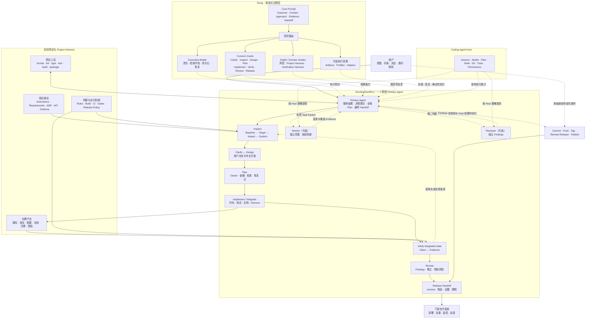

# Rung 产品需求与系统设计

> 版本：v0.1.0
> 状态：Released
> 发布日期：2026-08-20
> 文档职责：Rung 的产品形态、系统边界、治理模型与实现原则的唯一事实源

## 1. 执行摘要

Rung 是运行在 Coding Agent Host 之上的软件开发渐进式治理 Skill。它覆盖从用户意图到可验证 Release 的完整开发范围，并在任务出现不确定性、风险、协作、验证声明或发布准备信号时，按需加载对应提醒、模板和确定性工具。

Rung 的默认形态是一层很薄的提示：

```text
Outcome · Context · Approach · Evidence · Handoff
```

Coding Agent 保持原有的推理、工具选择和实现风格。Rung 负责观察当前任务需要哪些开发关注面，并只提供能够改善下一步判断的内容。

每次 DevelopmentRun 由一个逻辑 Primary Agent 对集成结果负责。默认执行形态是一个 Primary Agent 和一个主 Session；检查半径、持久状态、Worker 与独立 Reviewer 根据影响、协调、恢复和风险信号增加。

Rung 的产品承诺是：

> 以尽可能低的上下文和流程成本，帮助 Coding Agent 把一次软件变更推进到有证据支持的可发布状态。

一次 DevelopmentRun 从 User Intent 开始，在当前任务达到 `release ready` 或经授权完成 `published` 时结束。Release 之后的生产部署、运行监控、运营和长期项目管理由下游系统接续。

## 2. 背景与机会

### 2.1 Coding Agent 已具备开发执行能力

现代 Coding Agent 通常能够阅读代码、编辑文件、执行测试、使用 Git、构建项目和调用外部工具。模型会根据用户目标与仓库事实选择具体实现方式。

开发质量仍会受到几个时点的影响：

- 用户意图存在关键歧义；
- 仓库约束、用户已有修改或事实源尚未进入上下文；
- 项目骨架、概念归属、模块边界或依赖方向需要结合当前代码判断；
- 接口、数据、依赖或发布影响容易被低估；
- 完成声明缺少实际测试、构建或制品证据；
- 代码已经修改，文档、版本或交付信息尚未同步。

这些时点适合加入短小、相关、可立即行动的提醒。

### 2.2 固定流程会产生治理成本

所有任务都显式经历需求文档、设计、计划、Gate、Review 和 Release Artifact，会带来以下成本：

- 小修改的准备时间超过实施时间；
- 大量模板挤占项目代码与用户需求的上下文；
- Agent 为满足流程字段生成低价值内容；
- 固定顺序限制模型根据仓库与问题选择路径；
- 边缘场景不断累积为更多规则和分支；
- 流程本身成为维护对象。

Rung 使用渐进式治理控制这些成本。治理深度由当前信号决定，资源只在能够改变决策时进入上下文。

### 2.3 完整覆盖与轻量执行可以同时成立

Rung 保留 Clarify、Inspect、Design、Plan、Implement、Verify、Review 和 Release 八个软件开发关注面。它们共同定义产品覆盖范围，并作为可组合的提示卡存在。

一次局部 Bugfix 可以自然完成理解、定位、修复、验证和交付，无需显式维护八阶段状态。一次数据迁移可以加载设计、计划、验证和发布提示，并使用持久 Artifact 支持跨会话执行。

## 3. 产品定义

### 3.1 产品形态

Rung 的第一产品形态是单一 Skill，由六类资源组成：

1. **Core Prompt**：极小的默认治理提示与按需路由；
2. **Execution Model**：DevelopmentRun 的责任、检查半径、持久化、协作和恢复契约；
3. **Concern Cards**：Clarify 到 Release 的独立提醒；
4. **Domain Guides**：只在特定复杂信号出现时加载的详细工程指南；
5. **Optional Assets**：复杂任务需要的开发制品模板；
6. **Deterministic Helpers**：重复、可机器检查工作使用的脚本。

自然语言判断由 Coding Agent 完成。确定性工具在能够提高可靠性、可复现性或效率时使用。

### 3.2 核心能力

Rung 提供九项核心能力：

1. **完整开发覆盖**：Intent 到 Release 的关注面均有可用提示；
2. **执行责任模型**：每次 DevelopmentRun 由一个逻辑 Primary Agent 持有集成结果，并按需扩展会话、Worker 与独立 Review；
3. **信号驱动治理**：风险或不确定性出现时增加治理深度；
4. **渐进披露**：只加载当前判断需要的 Reference；
5. **工程决策提醒**：在代码结构信号出现时关注概念归属、修改局部性、信息隐藏、依赖方向和抽象依据；
6. **Project Harness 治理**：读取、诊断和渐进演进已有项目的事实源、测试、工程规则、构建、CI 与交付控制；
7. **验证系统治理**：在证据缺口或 Harness 增长信号出现时，引导 Agent 分层构建和维护验证入口；
8. **证据提醒**：完成、兼容和可发布结论关联实际观察；
9. **发布交接**：根据项目形态整理 revision、制品、文档和已知风险。

### 3.3 目标用户与项目

Rung 面向使用 Coding Agent 创建或修改软件的个人开发者和团队，适用于：

- 空项目、原型和首个版本；
- 已有代码但工程约束较少的项目；
- 具备测试、架构、文档和发布流程的成熟项目；
- 单体仓库、Monorepo 和多模块项目；
- 不同语言、框架、构建与包管理系统。

Rung 的核心提示与语言、框架解耦。仓库事实和项目工具决定实际命令、实现模式与交付形式。

### 3.4 成功标准

Rung 的实际价值通过行为判断：

- 普通任务的默认上下文开销很小；
- Agent 不因 Rung 自动创建低价值文档或工作区；
- 关键风险出现时，相关提醒能够及时进入决策；
- 工程设计提醒只在代码结构判断可能改变实现方向时加载；
- 新模块、公共表面、依赖和抽象能够由当前需求与仓库事实解释；
- Review 能够从实际 diff 发现修改扩散、知识泄漏和无依据复杂度；
- 已有 Project Harness 可靠时被直接复用，出现冲突、误报、漏报、波动、漂移或 Gate 变化时能够进入独立诊断与渐进演进；
- 验证系统能够从支持当前声明的最低成本层开始，并明确入口、归属、环境、隔离、清理、诊断和维护条件；
- Agent 保留多样的实现和验证路径；
- 每次 DevelopmentRun 始终有一个对整体结果负责的 Primary Agent；
- 项目检查从安全所需的最小半径开始，只有影响信号出现时才扩展；
- Plan、持久化、额外 Session、Worker 和独立 Reviewer 都由实际协调或风险收益触发；
- Worker 产出经过 Primary Agent 集成，最终验证针对合并后的代码状态；
- 完成报告具有与任务规模相称的实际证据；
- 高风险或跨会话任务能够按需增加结构化治理；
- Release 交付对应明确代码状态和已知风险。

## 4. 系统边界

### 4.1 开始边界：User Intent

Rung 从用户表达开发意图开始。意图可以是：

- 创建项目；
- 实现功能；
- 修复缺陷；
- 执行重构；
- 完成接口、数据、依赖或架构迁移；
- 更新配置或文档；
- 准备版本发布。

Rung 通过 Outcome 提醒帮助 Agent 理解期望结果，并在关键产品方向仍不明确时提示用户决策。

### 4.2 结束边界：Release

Rung 在当前软件变更达到可交付状态时完成一次 DevelopmentRun。Release 的具体形态由项目决定，可以包括：

- 对应明确 revision 的代码、测试、配置和文档；
- 可复现生成的软件包、二进制、镜像或静态产物；
- 版本、Changelog 或 Release Notes；
- 验证结果、已知限制和未覆盖风险；
- 项目已有流程要求的 Manifest、签名或校验信息。

代码库没有独立打包产物时，Release Package 可以由可发布 revision、验证证据与交付说明组成。

### 4.3 Release 交接

Rung 可以开发和验证 Dockerfile、CI 配置、Helm Chart、Terraform、迁移文件、构建脚本和发布配置。通过用户授权执行的 Git Push、Tag、远端 Release 或包发布可以记录为 `published`。

生产部署、流量切换、线上数据变更和运行状态由相应交付系统执行。Rung 将经过验证的配置、制品引用、顺序、风险和恢复信息交给这些系统。

### 4.4 外部动作

用户授权和 Coding Agent Host 的权限模型控制提交、推送、发布、消息、部署及其他外部写操作。Rung 只在当前任务范围内提醒授权触发点和结果记录。

## 5. 渐进式治理模型

### 5.1 默认薄层

Rung 被调用后，默认只保留五个简短提示：

| 提示 | 关注问题 |
|---|---|
| Outcome | 用户最终需要观察到什么结果？ |
| Context | 哪些仓库事实、约束和已有修改影响这次工作？ |
| Approach | 当前最小且连贯的实现方向是什么？ |
| Evidence | 哪些实际结果足以支持完成声明？ |
| Handoff | 代码、文档、版本和风险是否达到本次交付要求？ |

Agent 可以在内部使用这些提示。用户侧只呈现有助于协作、决策或验证的信息。

### 5.2 治理循环

```text
正常开发
   │
   ├─ 出现不确定性、风险、协调或交付信号
   │        ↓
   │   加载一个相关提示卡
   │        ↓
   │   调整当前判断或行动
   │
   └─ 继续开发 → 收集相称证据 → Release 交接
```

每次只处理当前最有价值的治理信号。新证据可以触发另一个提示卡，也可以回到先前关注面。

### 5.3 治理信号

以下信号常常值得增加一层提醒：

- 用户目标、公共行为或验收方式存在关键歧义；
- 相关代码、仓库规则、命令或用户修改尚未定位；
- 变化涉及公共接口、持久化数据、认证、安全或隐私；
- 创建项目骨架、顶层模块或新的公共能力；
- 局部需求跨越现有边界，或者新增依赖、共享状态和抽象；
- 条件、状态或实际 diff 的增长显示概念归属可能需要重新判断；
- 多模块、依赖方向、迁移顺序或回退条件需要协调；
- 任务跨会话、多人或多个执行单元；
- 测试、构建、兼容或发布结论需要证据；
- 现有检查无法证明当前声明，或者开始新增 Fixture、Mock、测试服务、文档检查、CI Gate、构建、打包或端到端基础设施；
- 验证入口出现重复、波动、环境泄漏、运行成本增长或失败诊断困难；
- 项目指令、需求、文档、测试、实现、静态规则、构建、CI 或 Release Policy 相互冲突，或者这些机制本身进入修改范围；
- 正确行为被拒绝、错误行为被接受，或者已有检查、规则、矩阵与 Gate 需要删除、放宽、替换或迁移；
- 实际 diff 超出最初预期；
- 发布信息、版本、制品或下游交接需要整理。

没有相关信号时，Agent 按普通开发方式继续。

### 5.4 可组合关注面

八个关注面提供开发导航：

```text
Clarify · Inspect · Design · Plan · Implement · Verify · Review · Release
```

它们支持以下组合方式：

- 小任务合并多个关注面；
- 已有明确需求时直接从 Inspect 或 Implement 开始；
- 项目已有设计和计划时沿用现有事实源；
- Verify 或 Review 发现新信息时回访相关关注面；
- Release-only 任务聚焦现有 revision、证据和制品；
- 高风险任务同时加载少量相关提示卡。

Stage 名称用于路由和交流，无需维护显式状态机。

Concern Card 是 Primary Agent 使用的能力入口，不与 Agent 数量或 Session 数量绑定。

### 5.5 模型自主性

Rung 的 Reference 主要包含五类内容：

1. 何时加载；
2. 值得考虑的问题；
3. 能够改变判断的失败模式与证据；
4. 复杂领域需要的方案、迁移、恢复和复查细节；
5. 值得进一步加深治理的信号。

Agent 根据项目事实决定顺序、工具、实现方式、测试策略和表达形式。项目已有规则与工具优先进入判断。

### 5.6 工程决策治理

代码结构质量作为横切关注面进入 Inspect、Design、Implement 和 Review。Rung 在结构信号出现时引导 Agent 回到当前仓库与需求事实：

- 需求改变哪个稳定概念，现有组件由谁拥有该概念；
- 哪些代码会因同一原因变化，修改范围是否与概念范围相称；
- 调用者完成职责所需的最小知识是什么，哪些状态、格式、SDK 和执行顺序可以留在边界内部；
- 新模块、公共表面、依赖或抽象由哪个当前需求、真实变体、不稳定边界或稳定契约支撑；
- 条件与状态增长是否暴露了缺失的领域概念或不变量；
- 实际 diff 是否扩大了公共表面、跨模块知识、共享状态和后续修改范围。

Greenfield 工作围绕首个可交付能力建立最小可运行骨架。顶层边界对应当前概念、已知独立变化或真实外部依赖，并随后续需求校准。

名称、文件大小、类数量、目录层级和设计模式只作为观察信号。项目规则、调用关系、数据流、测试、依赖图和实际变化提供设计依据。能够由 formatter、linter、类型检查、测试、构建或 CI 判断的规则交给项目工具。

局部设计判断可以直接体现在代码与测试中。新增顶层模块、公共契约、核心依赖方向、共享状态或关键数据模型时，根据协作与恢复需要简要记录 Architecture Impact 或更新项目已有设计事实源。

### 5.7 Project Harness 治理

Project Harness 是目标项目中影响软件如何被理解、修改、检查、构建和交付的机制集合，包括项目指令与事实源、工程规则、Verification Harness、开发与构建工具，以及 CI 与 Release 控制。

Rung 对成熟项目采用三种按信号选择的行为：

- **Use**：相关事实一致、检查可靠时，直接遵循和复用现有 Harness；
- **Extend**：当前 Claim 缺少证据或入口时，在最近的可靠边界增加必要能力；
- **Evolve**：Harness 自身出现冲突、误报、漏报、漂移、波动、高成本或政策变化时，使用独立证据和渐进迁移修复判断系统。

Test System 是 Verification Harness 的子集，Verification Harness 是 Project Harness 的子集。测试内容维护、Harness 能力扩展、共享测试系统演进和 Gate 政策演进采用不同治理深度。集合归属本身不触发高层流程；共享判断机制、证据覆盖、可靠性、成本、诊断或交付控制发生变化时加载详细 Harness Evolution 指南。

修改 Harness 时，被修改组件不作为证明自身正确的唯一依据。删除、跳过、放宽、重试、隔离或替换已有保护时，记录原 Claim、替代证据、Coverage Delta 和残余风险。影响多个模块、平台、团队或 Release Gate 的变化保留生效、回退和旧机制清理条件。

### 5.8 上下文预算

Rung 将 Skill 包的信息容量与一次任务的实际上下文开销分别管理。复杂领域可以保留充分细节，加载路径保持轻量：

- `SKILL.md` 只包含产品目的、五个基础提示和一级信号路由；
- Concern Card 保持短小，负责当前关注面的关键问题和下一级路由；
- Domain Guide 可以详细描述复杂判断、失败模式、迁移和证据，只在精确领域信号出现时加载；
- 普通任务通常加载 `SKILL.md` 与零到一张 Concern Card；
- Profile、Domain Guide、Artifact 和脚本分别由风险、复杂度、持久化或确定性执行需要触发；
- 模板作为输出资源使用，不作为默认指令加载；
- 同一规则只保留一个维护位置；
- 行为评测记录一次任务实际读取的 References、字节或 tokens，以及由此产生的工程收益。

仓库测试使用 UTF-8 字节数设置分层上限：`SKILL.md` 2,800 bytes、单张 Concern Card 1,300 bytes、共享路由 Reference 2,200 bytes、复杂 Domain Guide 依职责设置 4,500 至 11,000 bytes、Profile 360 bytes。这些上限负责防止单层无界增长，不代表目标长度。宿主实际报告的 tokens 与一次任务加载总量进入行为评测。

## 6. 产品包与渐进披露

### 6.1 包结构

```text
rung/
├── SKILL.md
├── agents/
│   └── openai.yaml
├── references/
│   ├── workflow.md
│   ├── risk-signals.md
│   ├── artifacts.md
│   ├── execution-model.md
│   ├── project-harness.md
│   ├── harness-evolution.md
│   ├── verification-harness.md
│   ├── clarify.md
│   ├── inspect.md
│   ├── design.md
│   ├── plan.md
│   ├── implement.md
│   ├── verify.md
│   ├── review.md
│   └── release.md
├── profiles/
│   ├── lite.md
│   ├── standard.md
│   └── strict.md
├── assets/
└── scripts/
```

### 6.2 披露层级

```text
Skill metadata
      ↓
SKILL.md 薄提示与路由
      ↓
当前信号对应的 Concern Card、Execution Model 或深度提示
      ↓
精确领域信号对应的详细 Domain Guide
      ↓
实际需要的模板或确定性脚本
```

Metadata 支持发现，`SKILL.md` 支持轻量治理，Concern Cards 支持关注面选择，Domain Guides 支持复杂领域判断，Assets 和 Scripts 支持具体输出与确定性执行。

### 6.3 分发与发现

Rung 通过 Agent Skills 仓库分发。`rung/` 是可安装单元，`rung/SKILL.md` 是发现入口。安装器扫描元数据，将完整目录复制或链接到项目级或用户级 Skills 目录，并记录来源和内容标识。

根目录 `INSTALL.md` 维护安装坐标、作用域、冲突处理和验证契约。

### 6.4 跨宿主原则

核心提示使用跨宿主概念。文件操作、Shell、Git、测试、构建和外部工具由 Coding Agent Host 提供。宿主特定名称、UI 与依赖放在独立 metadata 或 adapter 中。

可安装 Skill 中由 Agent 读取的运行时指令、References、Profiles、模板和 UI metadata 以英文维护。产品定义、安装契约和仓库维护文档可以根据目标读者使用中文。

## 7. DevelopmentRun 执行模型

每次 DevelopmentRun 由一个逻辑 **Primary Agent** 持有。它对用户工作保护、决策整合、全局 Plan、最终 diff、集成验证、Review 和 Release Handoff 负责。模型实例可以在一次短任务中直接完成这个角色，也可以在后续 Session 中通过持久状态继续承担该角色。

### 7.1 默认执行形态

默认使用一个 Primary Agent 和一个主 Session。工作状态优先保留在当前对话和目标项目中，Concern Cards 由 Primary Agent 按需调用。

```text
确认 Outcome 与决策权限
        ↓
检查 Baseline 与 Target 事实
        ↓
形成足够支撑修改的 Design
        ↓
在协调有收益时维护 Plan
        ↓
Implement 或集成变更
        ↓
验证并 Review 集成状态
        ↓
Release Handoff
```

这条最小执行脊柱说明完整责任闭环。Primary Agent 可以合并、跳过、调序和回访关注面。一个局部修复可以在一次短循环中完成设计、计划、实现、验证、复查和交接。

以下信号可以扩展默认形态：

- 工作预计超出当前对话的可靠上下文时，增加跨 Session 恢复状态；
- 两个以上执行单元具有稳定契约和清楚所有权时，考虑 Worker-assisted execution；
- 第二判断能显著提高高风险结论的可信度时，增加独立 Reviewer。

### 7.2 检查半径

项目事实从最小安全半径开始建立。检查半径按影响证据扩展：

| 半径 | 需要建立的事实 | 常见触发 |
|---|---|---|
| Baseline | 项目根目录、适用指令、branch/revision、working tree、用户修改、相关工具入口 | 每次修改项目前 |
| Target | 直接 Owner、邻近调用者与依赖、相关测试、公共契约、配置和持久事实源 | 局部 Bugfix 或边界清楚的 Feature |
| Impact | 消费者、Schema、Migration、生成物、Lock 状态、Build、Package、CI 和 Release Control | 公共接口、持久数据、共享行为、依赖、平台或多模块变化 |
| System | 事先声明的系统边界、包含表面与未检查区域 | 明确审查、核心架构、广泛迁移、安全边界、构建系统替换或 Harness Evolution |

当下一步具有明确 Owner 和约束、相关用户工作得到保护、可能影响与检查路径已经有界、剩余未知项清楚可见时，当前检查已经足够。System 级检查需要声明可验证边界；仓库名称本身无法说明审查覆盖范围。

### 7.3 协作决策与设计权限

Clarify 管理用户参与的有后果决策和委托范围，Design 提供专业方案、权衡与可修正方向。两者可以在项目方案或修改方案逐步成形时交替发生。

Primary Agent 向用户提供通俗决策视图：当前问题、建议、直接结果、可信的发展影响、可逆性和需要用户选择的内容。关键风险保留在通俗视图中，技术机制与术语细节可以通过项目文档、设计 Artifact 或用户请求继续展开。

当用户将当前范围内的选择交给 Agent 时，Primary Agent 获得相应设计权限，并依据项目事实、可信的发展信号和未来修改成本做出选择。涉及人的界面、流程、信息呈现或交互时，Design 同时考虑任务流、信息层级、默认值、反馈、错误预防、恢复、一致性、可访问性和信任。

新信息一旦改变产品含义、用户接受的风险、持久数据语义、实质范围或委托之外的授权边界，Primary Agent 将决定权交回用户。

### 7.4 Design 的留档位置

设计信息进入最低且确实有未来消费者的承载位置：

| 情况 | 承载位置 |
|---|---|
| 局部、可逆、单 Session 选择 | 当前对话、代码和测试 |
| 当前 Session 内的中等协调 | Host Plan 或简短 Session Note |
| 公共契约、持久数据、核心归属、长期 UX、安全边界或迁移 | 项目拥有的 Requirement、ADR、API、Schema、Architecture 或 Configuration |
| 跨 Session、多执行者、持续比较或临时恢复 | 现有 Issue 或 `.rung/runs/<run-id>/design.md` |

稳定事实写入其长期项目 Owner。临时状态按照项目约定和明确清理条件保留或清理，同一设计事实保持一个维护位置。

### 7.5 Plan 与 Implement 的责任

Primary Agent 编写并维护全局 Plan，也默认负责实际修改：

| 任务形态 | Plan 形态 |
|---|---|
| 一个连贯且可直接检查的修改 | 内部 micro-plan |
| 一个 Session 内的多个依赖步骤 | Host Plan |
| 跨 Session、多执行者、迁移、兼容窗口、风险顺序或正式恢复 | 项目 Issue 或 `.rung/runs/<run-id>/plan.md` |

每个重要执行单元记录结果或 Acceptance、Owner、文件或模块、前置条件、需要保留的行为、预期修改、完成检查和恢复点。实现证据改变归属、接口、数据、风险或验收时，Primary Agent 回访 Inspect、Clarify 或 Design 并更新 Plan。

Primary Agent 在实现期间保护用户修改，遵循适用指令，同步生成源和持久事实，并在低成本检查能够尽早暴露漂移时运行它们。

### 7.6 Worker-assisted execution

Worker 由 Host 能力和策略提供。稳定共享契约、可分离所有权、互不重叠的文件或模块、明确集成点和可用的最终检查路径构成有效委派信号。耦合设计、重叠文件、顺序迁移和快速变化的接口继续由 Primary Agent 持有，直到边界稳定。

每个 Worker 获得有界 Task Packet：

- 结果与 Acceptance；
- 拥有的文件或模块以及排除范围；
- 相关指令、项目事实和共享契约；
- 需要保护的用户工作；
- 允许动作与授权边界；
- 应执行的检查与预期 Handoff。

Worker 返回变更路径、检查结果、假设、发现和集成关注点。Primary Agent 维护全局顺序与契约，检查 Worker 输出，解决集成影响，并对组合状态负责。

### 7.7 Review 责任

Primary Agent 默认对集成 diff、需求、设计、Evidence 和交付状态进行相称复查。普通发现直接修正，实质发现回到其所属关注面。

公共契约、安全或隐私边界、持久数据、核心架构、广泛迁移、Required Gate、高影响 Harness Evolution、正式政策或用户明确要求出现时，独立 Reviewer 可以提供第二判断。Reviewer 提交 Findings；Primary Agent 负责处理结论和最终 Handoff。

### 7.8 跨 Session 恢复

无法在当前 Session 完成的运行只持久化后继者继续工作所需的信息：

- Outcome、已接受决策与委托设计范围；
- 项目根目录、Baseline revision 与受保护的用户工作；
- 权威事实与已选 Design；
- 已完成单元、Plan 状态与下一个动作；
- 已运行检查、Evidence 位置、缺口与开放风险。

恢复时重新读取适用指令，对比保存的 revision、working tree 与当前 Git 状态，重新验证受漂移影响的假设，再从下一个有意义的动作继续。接续模型在逻辑上承担同一个 Primary Agent 角色。

### 7.9 集成验证与 Release 责任

Verification 针对集成 revision 或明确描述的 working-tree state。Worker 检查是候选 Evidence，Primary Agent 在合并后确认这些证据仍覆盖当前 Claim；最终检查覆盖组合后的实际状态。

Primary Agent 汇总用户可观察结果、实际检查、revision 或 Artifact 标识、未覆盖范围、残余风险与 Release 状态。Commit、Push、Tag、Remote Release、Package Publish 和其他外部写操作继续使用各自所需的用户授权与 Host 权限。

## 8. 核心概念

### 8.1 DevelopmentRun

一次从用户意图到 Release 交接的软件变更。每次运行有一个逻辑 Primary Agent。DevelopmentRun 可以只存在于当前对话与项目 diff 中，也可以在复杂任务中持久化。

有恢复或协作需要时，可以记录：

- 目标与当前决策；
- 相关项目事实；
- 已完成工作与待办；
- 当前证据和未解决风险；
- 代码基线与 Release 状态。

### 8.2 Primary Agent

对一个 DevelopmentRun 的集成结果负责的逻辑角色。它持有路由、用户工作保护、决策整合、全局 Plan、最终 diff、集成 Evidence、Review 和 Release Handoff。跨 Session 接续时，后继模型通过恢复状态继续承担这个角色。

### 8.3 Worker

接收有界 Task Packet 的可选执行者。Worker 拥有明确文件或模块范围、共享契约、动作权限与检查责任，并将变更和发现交回 Primary Agent 集成。

### 8.4 Reviewer

对集成状态提供第二判断的可选角色。Reviewer 产生 Findings，Primary Agent 负责处理、接受残余风险并完成 Handoff。

### 8.5 Session

Host 提供的一段连续对话与执行上下文。默认 DevelopmentRun 使用一个主 Session；需要恢复时通过最小持久状态连接后续 Session。

### 8.6 Inspection Radius

一次检查实际覆盖的项目表面。Baseline、Target、Impact 和 System 四级半径从运行基线逐步扩展到声明过的系统边界，扩展由影响证据驱动。

### 8.7 Governance Signal

表示额外提醒可能改善当前判断的事实。Signal 来自任务歧义、变更风险、项目结构、协作需要、验证声明或发布交付。

Signal 只触发相关资源，不要求完整升级整套流程。

### 8.8 Concern Card

围绕一个开发关注面组织的短 Reference。Concern Card 可以独立加载、组合使用和重复访问。

### 8.9 Depth Hint

Lite、Standard、Strict 是可选的治理深度简称。Agent 可以直接使用相关提醒，无需显式声明 Profile。

### 8.10 Artifact

帮助跨会话恢复、多人协作、正式审查或发布交接的持久信息。Artifact 可以使用 Rung 模板，也可以直接更新项目已有 Requirements、ADR、测试计划、Issue 或 Release Notes。

### 8.11 Evidence

支持某项结论的实际观察，例如命令、退出码、测试报告、构建产物、运行截图、日志、diff、revision 或用户验收。

证据形式和深度与声明风险相称。

### 8.12 Project Harness

目标项目中影响软件如何被理解、修改、检查、构建和交付的机制集合。它包含意图与事实源、工程约束、Verification Harness、开发与构建工具，以及 CI 与 Release 控制。

### 8.13 Verification Harness

为软件声明产生可复现证据的项目内验证结构与入口。它可以包含测试代码、Fixture、测试数据、Fake、Mock、测试服务、测试数据库、文档检查、契约检查、CI Gate、构建检查、打包检查和端到端环境。

Harness 的长期实现归目标项目所有。Rung 在证据缺口、基础设施新增、运行成本或可靠性信号出现时提供分层治理提示；`.rung/` 可以暂存本次 Harness 的清单、映射和维护决定。

### 8.14 Harness Evolution

对已有 Project Harness 的权威关系、共享执行方式、证据覆盖、可靠性、成本、诊断或交付控制进行有证据、可回退、可迁移的改变。Harness Evolution 同时验证产品行为、Harness 信号与必要的迁移表面。

### 8.15 Release Handoff

当前变更达到可交付状态时向代码托管、包仓库或下游交付系统提供的代码状态、制品、说明和风险信息。

## 9. 八个开发关注面

| 关注面 | 常见加载信号 | 提示目标 |
|---|---|---|
| Clarify | 用户与 Agent 需要形成有后果的决定，或用户委托当前范围内的设计选择 | 得到已接受决定、委托权限与开放选择 |
| Inspect | 相关代码、规则、命令、接口或用户修改未知 | 以相称检查半径获得可执行的项目事实 |
| Design | 产品行为、UX、项目骨架、概念归属、边界、接口、数据、依赖或错误语义需要选择 | 形成与项目相称、依据充分且可修正的专业方案 |
| Plan | 多步骤、跨模块、迁移、协作或恢复需要协调 | 由 Primary Agent 建立有 Owner、依赖、检查与恢复点的全局 Plan |
| Implement | 进入代码、测试、配置或文档修改 | 实现并集成符合当前决定和事实的修改 |
| Verify | 需要证明行为、兼容、构建或制品结论 | 在集成状态上获取与 Claim 相称的 Evidence |
| Review | diff 较大、结构影响超出预期、风险较高或准备交付 | 由 Primary Agent 或独立 Reviewer 发现并处理遗漏 |
| Release | 准备版本、制品、说明或外部发布 | 由 Primary Agent 整理可复现、可追踪的 Handoff |

Concern Card 提供按需提醒。Agent 根据当前任务选择一个或多个关注面，并自行判断何时继续、组合或回访。

## 10. 治理深度提示

### 10.1 Lite

适合局部、可回退、验证路径清楚的变化。常见形态：

- 一个 Primary Agent 在一个主 Session 中确认目标、Baseline 与 Target；
- 直接实施最小变更；
- 在集成状态上运行局部高信号检查；
- 用简短完成报告说明结果和缺口。

Lite 通常不创建 Rung Artifact，也不使用 Worker 或独立 Reviewer；新信号出现时再增加相应资源。Agent 无需显式声明 Profile。

### 10.2 Standard

适合普通 Feature、多文件修改、新模块、中等重构或需要跨会话继续的任务。可以增加：

- 简短持久 Brief、Context 或 Plan；
- 在协调或恢复确有收益时使用 Host Plan、跨 Session 状态或有界 Worker；
- 验收条件与验证的映射；
- 模块或集成级检查；
- 文档和发布影响审查。

Agent 只创建对协调和恢复有价值的 Artifact。

### 10.3 Strict

适合公共接口、安全隐私、持久化数据、核心架构、迁移或发布链路变化。可以增加：

- 正式设计、ADR、兼容与迁移说明；
- 持久恢复状态、回退、数据恢复和执行前检查；
- 集成、端到端、安全、构建和打包证据；
- 独立审查与正式 Release 交接信息。

Strict 提示增加判断深度，同时保留 Agent 对具体方法的选择。

### 10.4 深度调整

治理深度可以局部增加。例如一个普通 Feature 只在数据库迁移部分使用 Strict 提示，其余实现保持 Lite 或 Standard。新证据降低风险后，后续内容可以恢复轻量。

## 11. Artifact 与确定性工具

### 11.1 Artifact 使用信号

以下情况常常值得持久化：

- 任务跨会话或需要恢复；
- 多个执行者共享当前决策；
- 接口、数据、迁移或发布具有长期影响；
- 项目已有正式需求、ADR、测试计划或发布流程；
- 用户明确需要审阅制品。

普通单会话任务可以只保留对话、实际 diff 与验证结果。

### 11.2 事实源

ProjectContext 优先索引项目已有 README、Requirements、ADR、接口规范、构建配置和测试配置。本次变化产生的长期事实写回相应项目事实源。

`.rung/runs/<run-id>/` 作为可选工作区，适合保存运行控制状态和项目暂时没有承载位置的制品。

### 11.3 模板

`assets/` 提供 Development Brief、Project Context、Solution Design、Change Plan、Project Harness Change、Verification Harness、Verification Report、Review Result 和 Release Manifest 模板。Agent 可以复制完整模板，也可以只采用当前任务需要的字段。

### 11.4 脚本

`scripts/` 提供项目索引、按 Tier 筛选的验证计划执行、Artifact 检查和 Release 检查。它们适合重复执行、结构化输出或需要可靠退出码的任务。

脚本输出作为候选证据，Agent 结合项目实际解释其意义。

## 12. Project Harness、验证与 Release

### 12.1 Project Harness 的层级关系

```text
Project Harness
├── 意图与事实源：Instructions · Requirements · README · ADR · API · Schema
├── 工程约束：Formatter · Lint · Types · Architecture · Dependencies
├── Verification Harness
│   ├── Test System：Cases · Assertions · Fixtures · Data · Fakes · Mocks · Runners
│   └── Contract · Integration · E2E · Docs · Build · Package · Evidence
├── 开发与构建工具：Environment · Dependencies · Codegen · Migration
└── 交付控制：CI · Required Gates · Release Policy · Artifact Rules
```

一个实际组件可以承担多个逻辑责任。例如 CI 同时编排测试、生成 Evidence 并执行 Release Policy；Schema 同时是权威事实源和契约检查输入。

测试改造在集合关系上属于 Verification Harness 改造。局部回归用例和经过批准的 Expected Result 同步通常沿用普通 Implement 与 Verify；共享 Fixture、Mock、Runner、Framework、Environment、Isolation、Retry、Quarantine、Coverage 或 Gate 变化进入相应深度的 Harness Evolution。

### 12.2 两条独立的治理轴

| 轴 | 选择内容 | 取值 |
|---|---|---|
| Governance Depth | 判断、协调、持久化和复查深度 | Lite · Standard · Strict |
| Verification Tier | 证据覆盖的技术范围 | Tier 0 · Tier 1 · Tier 2 · Tier 3 |

两条轴分别由当前任务信号选择。一个高风险局部改动可以使用 Strict 治理并运行少量高信号检查；一个边界清楚的 Release-only 任务可以保持轻量，同时复用项目已有的 Tier 3 发布矩阵。

### 12.3 风险驱动证据

验证从当前声明出发。局部语法或文档修改可以使用目标检查；跨模块行为需要集成证据；发布准备可以增加完整构建、打包和端到端检查。

Verification Tier 作为可选简称：

| Tier | 证明范围 | 典型证据 |
|---|---|---|
| 0 | 明显错误和目标文件 | 格式、语法、smoke check |
| 1 | 局部行为 | 静态检查、单元或模块测试 |
| 2 | 跨模块与兼容 | 集成、契约、构建、安全或依赖检查 |
| 3 | 完整发布准备 | 测试矩阵、端到端、打包与交付检查 |

Agent 可以直接选择检查，无需在用户回复中标注 Tier。

`run_verification.py --max-tier <0-3>` 可以只执行计划中不高于指定 Tier 的检查，并在 Evidence 中记录已选择和已跳过项。执行器保持显式命令数组、项目根目录边界、超时、原始输出和顺序执行；重试、依赖图、环境编排与矩阵扩展由实际项目需求决定。

### 12.4 Verification Harness 构建与维护

现有项目检查能够支持声明时，Agent 直接复用其测试、文档、构建、CI 和打包入口。出现证据缺口时，Verify 可以继续加载详细的 Verification Harness Guide，选择能够区分正确与错误行为的最低成本层。

新增或修改 Harness 时关注以下信息：

- 当前声明或风险缺少哪一项可靠证据；
- 哪个项目原生入口、Fixture 或环境可以复用；
- 目标、组件、契约、集成和发布检查分别归属何处；
- Fixture、测试数据、Fake、Mock、测试服务和测试数据库由哪个稳定边界拥有；
- 前置条件、Setup、隔离、Cleanup 和失败诊断是否清楚；
- 错误行为能否让检查产生可见失败，重试是否保留原始失败信号；
- 哪些检查属于必需 Gate、扩展检查或诊断工具；
- 重复、缓慢、波动、过时或绑定实现细节的 Harness 代码何时复查、修复或移除。

Harness 代码、项目测试配置和 CI 配置进入目标项目的正式结构。需要跨会话协调或正式复查时，可以使用 `.rung/runs/<run-id>/verification-harness.md` 记录当前清单、Claim-to-Layer 映射、入口、所有权、成本与维护条件。

### 12.5 已有 Project Harness 的演进

已有项目首先使用与当前任务相关且可靠的 Harness。以下信号表明 Harness 自身进入修改范围：事实源冲突；正确行为被拒绝；错误行为被接受；Fixture、Mock、Snapshot、Schema 或生成物漂移；检查依赖共享状态、时间、顺序或隐藏环境；Retry、Quarantine 与 Ignore 隐藏原始失败；成本增长却没有新增证据；已有保护需要删除、放宽、替换或迁移。

Agent 在修改前区分 Product Defect、Harness Defect、Coupled Defect 和 Unresolved Authority，并为重要 Harness Claim 选择至少一个独立于被修改组件的事实或行为锚点。验证可以分为三个表面：

- **Product Surface**：用户行为、兼容、数据、错误、构建和制品保持正确；
- **Harness Surface**：Known-good 能通过，Relevant known-bad 能可见失败，隔离、清理、诊断和成本符合其角色；
- **Transition Surface**：新旧入口、消费者、平台、生效、回退和清理条件得到相称验证。

删除、跳过、放宽、Snapshot 更新、Retry、Quarantine、Ignore、Matrix 缩减或 Required Gate 变化需要记录 Coverage Delta：原 Claim、原失败类别、替代或保留证据、覆盖增加、覆盖减少、残余风险、Owner 和复查条件。

大范围改造可以选择 Baseline、并行或 Diagnostic 运行、可靠性观察、Required 激活、旧路径移除和事实源清理等迁移节点。实际项目只采用能够增加证据的节点，并为双系统设置结束条件。跨会话、多 Owner 或正式评审可以使用 `.rung/runs/<run-id>/harness-change.md`。

### 12.6 Evidence 提醒

对于 `complete`、`pass`、`compatible`、`reproducible` 和 `release ready` 等结论，Rung 提醒 Agent 保留相称的实际依据。环境、权限或工具限制进入未覆盖范围和残余风险说明。

### 12.7 Release 判断

Release 关注以下信息：

- 当前交付对应的代码状态或 revision；
- 用户可观察结果与验收状态；
- 实际执行的测试、构建或打包证据；
- 项目需要的文档、版本和发布说明；
- 交付物位置与复现方式；
- 已知限制、未覆盖范围和下游动作。

小任务可以使用简短 Release 摘要。具有正式发布流程的项目可以使用 Release Manifest 和确定性检查脚本；`ready` 或 `published` 状态引用本地 Evidence 时，Evidence 使用可解析的 JSON，并且顶层 `status` 为 `pass`。外部 CI 或制品系统可以使用 URI 作为证据引用。

## 13. 职责关系与覆盖流程

### 13.1 责任流程图



实线表示执行结果和项目事实的流动，虚线表示治理、可选角色或授权。Rung 为 Primary Agent 提供渐进提示与执行契约；Host 提供实际能力；目标项目承载长期事实、实现和 Harness；Primary Agent 始终收回 Worker 与 Reviewer 结果，并在集成状态上完成验证和交接。

### 13.2 用户

- 提供意图、约束、业务方向与可观察结果；
- 对改变产品含义、接受风险或持久数据语义的关键问题做决定；
- 可以把当前范围内的专业设计选择委托给 Primary Agent；
- 单独授权提交、推送、发布和其他外部动作；
- 选择需要审阅的正式制品或治理深度。

### 13.3 Rung

- 提供五个基础提示和一个可恢复的 DevelopmentRun 执行契约；
- 识别治理信号并路由相关 Concern Card、Execution Model、Depth Hint、Domain Guide、Asset 或 Script；
- 指导相称检查半径、Design 留档位置、Plan 所有权、Worker Task Packet 和跨 Session 恢复；
- 在项目约束可靠时复用 Project Harness，在 Harness 自身出现问题时路由独立诊断、Coverage Delta 与渐进迁移；
- 在证据缺口或 Harness 增长信号出现时提供分层验证系统治理；
- 提醒集成 Evidence、残余风险和 Release 交接；
- 控制默认上下文和流程成本。

### 13.4 Primary Agent

- 保护用户工作并整合项目事实、用户决定与委托设计权限；
- 维护全局 Plan，默认执行实际修改；
- 在有具体收益时分配有界 Worker 或请求独立 Review；
- 复查并集成所有执行者产出；
- 针对组合后的状态完成 Verification、Review 和 Release Handoff。

### 13.5 Worker 与 Reviewer

- Worker 在 Task Packet 声明的范围、契约、权限和检查责任内执行；
- Worker 将变更、局部检查、假设和集成关注点交给 Primary Agent；
- Reviewer 对指定集成状态提供独立 Findings；
- Primary Agent 处理 Findings，并保留最终交付责任。

### 13.6 Coding Agent Host

- 提供模型、Session、文件、Shell、Git、工具、权限和可选多 Agent 能力；
- 应用宿主安全策略、用户授权和并发或隔离策略；
- 为对话状态、Plan、Worker、Reviewer 和恢复信息提供可用承载面。

### 13.7 目标项目与项目工具

- 承载长期需求、设计、代码、测试、配置、Harness、迁移和发布材料；
- 编译、格式化、检查、测试、构建并生成软件制品；
- 提供项目真实的质量、兼容和发布约束；
- 为集成结论生成可追踪的机器 Evidence。

## 14. 工作类型

| 类型 | 值得关注的特有信号 |
|---|---|
| Greenfield | 用户价值、首个可交付能力、最小可运行骨架、已知边界、首个 Release |
| Feature | 可观察行为、接口与数据影响、回归范围 |
| Bugfix | 预期与实际、复现可信度、根因、回归证据 |
| Refactor | 行为保持边界、特征测试、结构收益 |
| Migration | 当前与目标状态、兼容窗口、顺序、恢复 |
| Dependency | API 变化、安全通告、锁文件、构建兼容 |
| Docs/Config | 文档或配置与实际行为的一致性 |
| Release-only | revision、证据、制品、版本和发布说明 |

工作类型用于选择少量特有提醒，不改变渐进式治理模型。

## 15. 安全与敏感信息

Rung 沿用用户、宿主和项目的安全边界：

- 数据访问保持在当前任务范围；
- 凭据、密钥和生产数据保留在专用系统；
- 删除、覆盖、迁移和不可逆操作先解析精确目标；
- 外部写操作在用户授权和宿主权限范围内执行；
- Artifact 记录凭据名称、权限要求或安全引用，不保存密钥值；
- 受权限或环境影响的检查进入未覆盖范围和恢复条件。

## 16. MVP 范围

MVP 包含：

- 一个可安装、可显式调用和可按描述触发的 Rung Skill；
- 五个默认治理提示；
- 信号驱动的按需路由；
- 一个按需加载的 Execution Model Guide，明确 Primary Agent、检查半径、Design 持久化、Plan 与 Implement 责任、Worker、Reviewer 和跨 Session 恢复；
- Clarify 到 Release 的八张 Concern Card；
- 归属、局部性、信息隐藏、依赖和抽象依据的工程决策提醒；
- 按需加载的 Project Harness 与 Harness Evolution 详细指南、可选 Harness Change Artifact；
- 按需加载的 Verification Harness 详细指南、可选 Harness Artifact 和 Tier 筛选执行；
- Lite、Standard、Strict 三种可选深度提示；
- 可选 Artifact 模板与按需创建的 `.rung/` 工作区；
- 项目检查、验证执行和 Release 检查脚本；
- Agent 与人共读的安装契约；
- Greenfield、Feature、Bugfix、Refactor 和 Migration 行为场景。

MVP 的实现顺序：

```text
1. 固化渐进式治理模型与上下文预算
2. 固化 DevelopmentRun 执行责任与恢复契约
3. 压缩默认 Skill 提示
4. 将八个关注面改为按需 Concern Card
5. 将 Profile、Artifact 与脚本改为可选资源
6. 用真实任务检查触发准确性、执行质量、治理收益和上下文成本
7. 根据观察到的失败补充最小内容
```

## 17. 行为验收场景

### 17.1 单 Session 小型 Bugfix

一个 Primary Agent 在一个 Session 内使用默认薄层完成 Baseline 与 Target 检查、修复、集成验证和简短 Handoff。任务没有新的影响信号时，不创建 Artifact，不分配 Worker，不扩展为 System 审查。完成报告包含修复结果、实际检查和仍未覆盖的范围。

对应执行模型场景记录在 `evals/cases/06-single-session-execution.md`。

### 17.2 普通 Feature

Agent 根据项目事实选择实现方式。当接口、数据或多模块信号出现时加载对应提示，并按需要形成简短计划或验证映射。

### 17.3 跨 Session 重构与恢复

Primary Agent 在 Session 结束前保存 Outcome、决定和委托范围、Baseline、用户工作、Design、已完成单元、下一动作、Evidence 与开放风险。接续 Session 重新读取指令，对比当前 Git 与保存状态，校准受漂移影响的假设，再继续有效工作。

对应恢复场景记录在 `evals/cases/07-cross-session-recovery.md`。

### 17.4 数据迁移

Agent 加载 Design、Plan、Verify、Release 与 Strict 深度提示，关注兼容窗口、顺序、回退、数据恢复和交付信息。

### 17.5 Release-only

Agent 复用项目已有实现和证据，只补充当前发布缺失的 revision、构建、制品、文档和风险信息。

### 17.6 工程设计与连续变化

创建项目骨架、增加顶层模块、修改跨模块能力或引入外部依赖时，Agent 根据当前概念、调用关系和真实变化选择边界。完成后的 diff 复查公共表面、依赖知识、共享状态、修改局部性和抽象依据。

行为评测使用连续任务观察模块化质量：第一项任务完成实现，后续隐藏任务引入一个合理变化，再比较正确性、修改传播、公共表面、依赖关系、无用途抽象和上下文成本。评测接受多个合理方案，不以固定目录、文件数量或设计模式作为答案。

仓库根目录 `evals/` 维护宿主无关的评测协议与场景。每次评测记录模型、宿主、工具权限、起始 revision、Rung revision、实际提示加载、最终 diff、验证结果、上下文成本和评审结论。基线、当前版本和候选版本使用相同输入并进行多次运行。

### 17.7 验证 Harness 增长

当一个跨边界行为缺少可靠证据时，Agent 复用项目原生入口，并只为当前 Claim 增加必要的 Fixture、隔离或集成检查。后续变化检验 Harness 的所有权、Setup、Cleanup、诊断能力、运行成本和修改局部性。

评测比较验证正确性、错误行为的可见失败、重复基础设施、与实现细节的耦合、波动处理和上下文成本。仓库中的对应场景记录在 `evals/cases/04-verification-harness-growth.md`。

### 17.8 已有 Project Harness 演进

成熟项目中的事实源、测试、实现、CI 或 Release Gate 发生冲突时，Agent 先识别权威关系和问题分类，再决定修改产品、Harness 或二者。Harness 修改使用独立锚点验证 Known-good 与 Relevant known-bad，并记录 Coverage Delta、消费者影响、生效、回退与旧路径清理条件。

行为评测观察 Agent 是否保留用户工作和原始失败，是否通过修改 Expected Result、Snapshot、Retry 或 Gate 制造虚假绿色，是否能在后续合理变化中复用单一事实源。对应场景记录在 `evals/cases/05-existing-harness-evolution.md`。

### 17.9 Worker-assisted integration

一个任务包含两个以上具有稳定共享契约、清楚集成点和互不重叠范围的执行单元时，Primary Agent 可以向 Worker 分配有界 Task Packet。评测检查上下文与所有权是否相称、用户工作是否得到保护、Worker 输出是否经过复查，以及最终 Evidence 是否覆盖集成 revision。Host 缺少多 Agent 能力时，同一执行模型由 Primary Agent 顺序完成。

对应委派与集成场景记录在 `evals/cases/08-worker-assisted-integration.md`。

场景验收同时观察：提示加载是否相关、默认上下文是否轻量、模型是否保留合理选择、完成结论是否具有相称证据。

## 18. 产品不变量

Rung 后续实现保持以下设计事实：

1. 产品范围从 User Intent 延伸到 Release Handoff；
2. 默认运行形态是薄提示层；
3. 治理内容由实际信号渐进加载；
4. 八个关注面支持组合、跳过和回访；
5. Agent 保留具体路径、工具和实现方式的选择；
6. Artifact、Profile、Tier 和脚本都是按需资源；
7. 项目事实、用户修改和宿主权限进入当前判断；
8. 完成与发布结论关联相称证据；
9. 外部动作遵循用户授权与宿主权限；
10. 上下文成本和治理收益共同决定新增内容；
11. 工程原则通过任务信号、情境问题和 diff 复查影响决策；
12. 可安装 Skill 的运行时内容以英文维护；
13. 验证 Harness 从证据缺口出发分层构建，并保留所有权、环境生命周期、失败诊断和维护条件；
14. Skill 包可以拥有充分的领域细节，一次任务的上下文开销由渐进披露和实际加载量控制；
15. Test System 属于 Verification Harness，Verification Harness 属于 Project Harness；集合归属与治理升级分别判断；
16. 被修改的 Harness 组件不作为证明自身正确的唯一依据；
17. Harness 保护被删除、放宽、重试、隔离或替换时记录 Claim-level Coverage Delta；
18. 影响多个消费者或交付 Gate 的 Harness 演进保留生效、回退和旧机制清理条件；
19. 每次 DevelopmentRun 由一个逻辑 Primary Agent 持有集成责任；
20. 默认执行形态是一个 Primary Agent 和一个主 Session；
21. 检查从 Baseline 与 Target 开始，并按影响证据扩展到 Impact 或声明过的 System 边界；
22. 局部可逆 Design 可以留在对话、代码和测试中，长期事实进入其项目 Owner；
23. Primary Agent 维护全局 Plan，并默认负责 Implement；
24. Worker 使用有界上下文和明确所有权，Multi-Agent 执行由收益、Host 能力与策略共同决定；
25. Worker 检查作为候选 Evidence，最终 Verification 针对集成状态；
26. 独立 Reviewer 与跨 Session 恢复由实际风险、审查或连续执行需要触发。

## 19. 长期愿景

```text
Human Intent
     ↓
Coding Agent 正常开发
     ↕
Rung 按信号提供渐进式治理
     ↓
Verified Release Handoff
```

Rung 让开发提醒在最有价值的时点出现：平常保持轻量，风险出现时提供深度，交付时保留证据。
